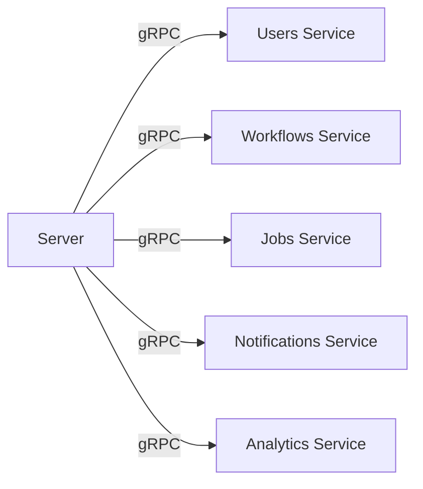
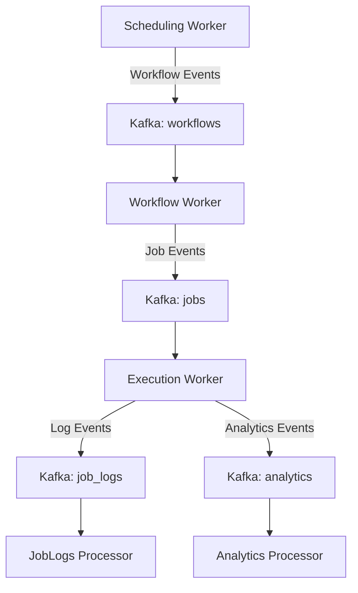

## Overview

Chronoverse implements a message-driven microservices architecture designed for reliability, scalability, and fault tolerance. The system uses a dual communication approach to balance responsiveness and reliability:

- **Kafka**: For reliable, asynchronous processing and event-driven workflows
- **gRPC**: For efficient, low-latency synchronous service-to-service communication

Data persistence is handled by PostgreSQL for transactional data and ClickHouse for analytics and high-volume job logs.

## System Components

The architecture consists of three main layers: infrastructure, services, and workers.

### Infrastructure Layer

<CardGroup cols={2}>
  <Card title="PostgreSQL" icon="database">
    Stores transactional data including workflows, jobs, users, and notifications
  </Card>
  <Card title="ClickHouse" icon="chart-column">
    High-performance analytics database for job logs and metrics
  </Card>
  <Card title="Redis" icon="bolt">
    In-memory cache for session management and real-time data
  </Card>
  <Card title="Kafka" icon="comments">
    Message broker for asynchronous event processing
  </Card>
  <Card title="MeiliSearch" icon="magnifying-glass">
    Fast search engine for job logs and workflow queries
  </Card>
  <Card title="Docker" icon="docker">
    Container runtime for executing workflow jobs
  </Card>
</CardGroup>

### Service Layer

The service layer exposes gRPC APIs for synchronous operations:

<Accordion title="Server (HTTP Gateway)">
  HTTP API gateway that exposes RESTful endpoints to external clients. Handles:
  - Authentication and authorization middleware
  - Request routing to internal gRPC services
  - Session management via Redis
  - Port: 8080
</Accordion>

<Accordion title="Users Service">
  Manages user accounts and authentication. Handles:
  - User registration and login
  - JWT token generation and validation
  - Notification preferences
  - Port: 50051
</Accordion>

<Accordion title="Workflows Service">
  Manages workflow definitions and configuration. Handles:
  - Workflow CRUD operations
  - Build status tracking
  - Consecutive failure counting
  - Workflow termination
  - Port: 50052
</Accordion>

<Accordion title="Jobs Service">
  Manages job lifecycle from scheduling through completion. Handles:
  - Job scheduling and status updates
  - Job log retrieval and streaming
  - Job history and filtering
  - Port: 50053
</Accordion>

<Accordion title="Notifications Service">
  Provides real-time alerts and status updates. Handles:
  - Server-Sent Events (SSE) for real-time notifications
  - Workflow and job state change notifications
  - Port: 50054
</Accordion>

<Accordion title="Analytics Service">
  Provides insights into performance and trends. Handles:
  - Job and workflow metrics
  - Performance analytics
  - Trend analysis
  - Port: 50055
</Accordion>

### Worker Layer

Workers consume messages from Kafka topics and perform background processing:

<Accordion title="Scheduling Worker">
  Identifies jobs due for execution based on their schedules. It:
  - Polls PostgreSQL for workflows ready to execute
  - Creates job entries in the database
  - Publishes job events to Kafka for processing
  - Supports automatic retry and error handling
</Accordion>

<Accordion title="Workflow Worker">
  Prepares workflow execution environments. It:
  - Consumes workflow events from Kafka
  - Builds Docker image configurations from workflow definitions
  - Prepares execution templates for CONTAINER workflows
  - Validates workflow payloads
  - Updates workflow build status
</Accordion>

<Accordion title="Execution Worker">
  Executes scheduled jobs in isolated containers. It:
  - Consumes job events from Kafka
  - Executes HEARTBEAT and CONTAINER workflow types
  - Manages job lifecycle (start, monitor, complete)
  - Captures stdout/stderr logs
  - Publishes logs to Kafka for persistence
</Accordion>

<Accordion title="JobLogs Processor">
  Persists execution logs to long-term storage. It:
  - Consumes log events from Kafka
  - Performs efficient batch insertion to ClickHouse
  - Indexes logs in MeiliSearch for fast searching
  - Optimizes storage and querying performance
</Accordion>

<Accordion title="Analytics Processor">
  Generates analytics data from job and workflow events. It:
  - Consumes events from Kafka
  - Aggregates metrics and performance data
  - Stores results in PostgreSQL for querying
  - Enables trend analysis and reporting
</Accordion>

## Communication Patterns

### Synchronous Communication (gRPC)

Services communicate via gRPC for low-latency, request-response operations:



<Note>
  All gRPC connections support mTLS encryption and include circuit breakers and retry logic for resilience.
</Note>

### Asynchronous Communication (Kafka)

Workers use Kafka topics for reliable, event-driven processing:



<Info>
  Kafka topics use SSL/TLS encryption and support consumer groups for horizontal scaling and fault tolerance.
</Info>

## Security Architecture

### Authentication & Authorization

- **JWT Tokens**: EdDSA (Ed25519) signatures for token generation and validation
- **Role-Based Access**: Admin and user roles with different permission levels
- **Session Management**: Redis-backed sessions with configurable TTL

### Transport Security

- **mTLS**: Mutual TLS authentication between all services
- **TLS 1.2/1.3**: Encrypted communication for all protocols
- **Certificate Management**: Automated certificate generation and rotation

### Network Isolation

- **Docker Network**: Internal bridge network isolates services
- **Port Exposure**: Minimal external port exposure in production
- **Proxy Access**: Docker socket access via security proxy

## Deployment Architecture

### Development Environment

```yaml
# All ports exposed for debugging
Ports:
  - 8080:8080   # Server HTTP API
  - 3001:3000   # Dashboard
  - 5432:5432   # PostgreSQL
  - 9440:9440   # ClickHouse
  - 6379:6379   # Redis
  - 9094:9094   # Kafka
  - 7700:7700   # MeiliSearch
  - 3000:3000   # Grafana (LGTM)
  - 50051-50055 # gRPC Services
```

### Production Environment

```yaml
# Minimal port exposure
Ports:
  - 80:80       # Nginx/Reverse Proxy
  - 443:443     # HTTPS
  - 3000:3000   # Grafana (Optional)

# All internal services communicate via Docker network
```

## Observability

### OpenTelemetry Integration

All services and workers export telemetry data:

- **Traces**: Distributed tracing across service boundaries
- **Metrics**: Performance counters and resource utilization
- **Logs**: Structured logging with context propagation

### LGTM Stack

Grafana's LGTM (Loki, Grafana, Tempo, Mimir) provides:

- **Grafana**: Visualization and dashboards
- **Tempo**: Distributed tracing backend
- **Loki**: Log aggregation and querying
- **Mimir**: Metrics storage and querying

<Note>
  OTEL data is exported via gRPC to the LGTM collector on port 4317.
</Note>

## Scalability

### Horizontal Scaling

- **Stateless Services**: All services can scale horizontally
- **Kafka Consumer Groups**: Workers scale by adding more instances
- **Load Balancing**: gRPC supports client-side load balancing

### Vertical Scaling

- **Auto Memory Limit**: Automatic memory management based on container limits
- **Auto Max Procs**: Automatic GOMAXPROCS tuning
- **Connection Pooling**: Optimized database connection management

### Performance Optimizations

- **Batch Processing**: JobLogs processor uses batching for efficiency
- **Parallel Execution**: Workers support configurable parallelism
- **Caching**: Redis caching for frequently accessed data
- **Indexing**: MeiliSearch for fast log search queries

## Fault Tolerance

### Service Resilience

- **Circuit Breakers**: Prevent cascading failures in gRPC calls
- **Retry Logic**: Automatic retry with exponential backoff
- **Health Checks**: Container health monitoring and restart policies

### Data Resilience

- **PostgreSQL**: ACID transactions with point-in-time recovery
- **Kafka**: Replication and acknowledgment guarantees
- **Redis**: Persistence with AOF and RDB snapshots

### Workflow Resilience

- **Failure Tracking**: Consecutive failure count per workflow
- **Auto-Termination**: Workflows terminate after max failures
- **Job Retry**: Failed jobs can be manually re-triggered

## Next Steps

<CardGroup cols={2}>
  <Card title="Workflows" icon="diagram-project" href="/concepts/workflows">
    Learn about workflow types and lifecycle
  </Card>
  <Card title="Jobs" icon="clock" href="/concepts/jobs">
    Understand job scheduling and execution
  </Card>
  <Card title="Workers" icon="gears" href="/concepts/workers">
    Deep dive into worker components
  </Card>
  <Card title="Deployment" icon="rocket" href="/deployment/docker-compose">
    Deploy Chronoverse to your infrastructure
  </Card>
</CardGroup>