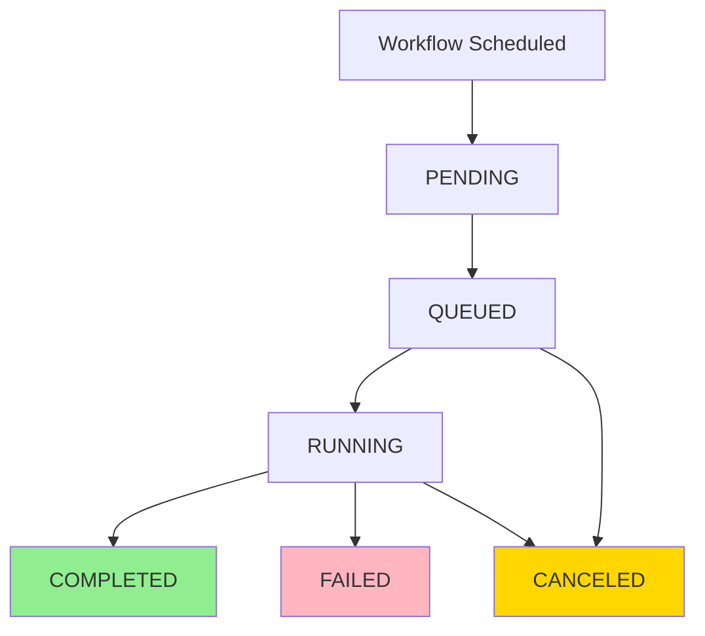

## Overview

Jobs are individual execution instances of workflows. When a workflow's scheduled time arrives, Chronoverse creates a job to execute the workflow's defined task. Each job has its own lifecycle, status, and log history.

## Job Properties

Every job has the following properties:

<ResponseField name="id" type="string" required>
  Unique identifier (UUID) for the job
</ResponseField>

<ResponseField name="workflow_id" type="string" required>
  ID of the parent workflow this job belongs to
</ResponseField>

<ResponseField name="user_id" type="string" required>
  ID of the user who owns the workflow
</ResponseField>

<ResponseField name="status" type="string" required>
  Current job status (see Job Statuses below)
</ResponseField>

<ResponseField name="trigger" type="string" required>
  How the job was triggered:
  - `AUTOMATIC`: Scheduled automatically by Chronoverse
  - `MANUAL`: Triggered manually by user via API
</ResponseField>

<ResponseField name="container_id" type="string">
  Docker container ID (for CONTAINER workflows only)
</ResponseField>

<ResponseField name="scheduled_at" type="timestamp" required>
  When the job was scheduled to run (RFC3339 format)
</ResponseField>

<ResponseField name="started_at" type="timestamp">
  When job execution actually started
</ResponseField>

<ResponseField name="completed_at" type="timestamp">
  When job execution finished
</ResponseField>

<ResponseField name="created_at" type="timestamp">
  When the job record was created
</ResponseField>

<ResponseField name="updated_at" type="timestamp">
  Last update timestamp
</ResponseField>

## Job Statuses

Jobs progress through several states during their lifecycle:

### PENDING

<Card icon="clock-rotate-left">
  **Initial State**: Job has been created but not yet queued for execution.
  
  - Job record exists in database
  - Waiting to be picked up by workers
  - Typically very short duration (milliseconds)
</Card>

### QUEUED

<Card icon="list">
  **Queued for Execution**: Job has been sent to the execution queue.
  
  - Event published to Kafka
  - Waiting for worker to process
  - Duration depends on worker availability
</Card>

### RUNNING

<Card icon="spinner">
  **Active Execution**: Job is currently executing.
  
  - Container/process is running
  - Logs are being captured in real-time
  - `started_at` timestamp is set
  - Duration varies by workflow complexity
</Card>

### COMPLETED

<Card icon="circle-check">
  **Successful Completion**: Job finished successfully.
  
  - Exit code 0 (or equivalent success indicator)
  - All logs captured and stored
  - `completed_at` timestamp is set
  - Consecutive failure counter is reset
</Card>

### FAILED

<Card icon="circle-xmark">
  **Failed Execution**: Job encountered an error.
  
  - Non-zero exit code or exception
  - Error logs captured
  - `completed_at` timestamp is set
  - Consecutive failure counter incremented
</Card>

### CANCELED

<Card icon="ban">
  **Canceled Execution**: Job was canceled before or during execution.
  
  - Manually canceled by user
  - Or workflow terminated mid-execution
  - Resources cleaned up
  - `completed_at` timestamp is set
</Card>

## Job Lifecycle



### 1. Scheduling Phase

**Trigger: Scheduling Worker**

Every poll interval (configurable), the Scheduling Worker:

1. Queries PostgreSQL for workflows due for execution
2. Checks workflow status and build readiness
3. Creates job records with `PENDING` status
4. Sets `scheduled_at` to current time
5. Publishes events to Kafka

<Accordion title="Scheduling Query Logic">
  ```sql
  SELECT * FROM workflows
  WHERE terminated_at IS NULL
    AND build_status = 'COMPLETED'
    AND (
      last_execution_time IS NULL
      OR last_execution_time + (interval * INTERVAL '1 minute') <= NOW()
    )
  ```
</Accordion>

<Note>
  **Automatic Trigger**: Jobs created by the Scheduling Worker have `trigger = AUTOMATIC`.
</Note>

### 2. Queue Phase

**Status: PENDING → QUEUED**

Once events are published to Kafka:

1. Job status updates to `QUEUED`
2. Events wait in Kafka topics based on workflow type:
   - HEARTBEAT workflows → `jobs` topic
   - CONTAINER workflows → `workflows` topic (build first)
3. Consumer groups ensure at-least-once delivery

### 3. Execution Phase

**Status: QUEUED → RUNNING**

#### For HEARTBEAT Workflows

**Worker: Execution Worker**

1. Consumes job event from `jobs` topic
2. Updates status to `RUNNING`
3. Sets `started_at` timestamp
4. Executes health check logic
5. Captures result (success/failure)

#### For CONTAINER Workflows

**Worker: Workflow Worker → Execution Worker**

Two-phase execution:

**Phase 1: Workflow Worker**
1. Consumes workflow event from `workflows` topic
2. Retrieves workflow configuration from Redis
3. Validates Docker image availability
4. Prepares execution environment
5. Publishes job event to `jobs` topic

**Phase 2: Execution Worker**
1. Consumes job event from `jobs` topic
2. Updates status to `RUNNING`
3. Sets `started_at` timestamp
4. Creates Docker container with configuration
5. Starts container execution
6. Streams stdout/stderr to Kafka's `job_logs` topic
7. Monitors container lifecycle

<Info>
  Container logs are streamed in real-time via Redis for live viewing while also being published to Kafka for persistence.
</Info>

### 4. Completion Phase

**Status: RUNNING → COMPLETED/FAILED/CANCELED**

When execution finishes:

1. Container exits (or heartbeat completes)
2. Exit code determines outcome:
   - Exit code 0 → `COMPLETED`
   - Exit code ≠ 0 → `FAILED`
   - Canceled by user → `CANCELED`
3. Sets `completed_at` timestamp
4. Updates job status in database
5. Publishes analytics events to Kafka
6. Cleans up resources (container removal, cache cleanup)

### 5. Post-Processing Phase

**Workers: JobLogs Processor & Analytics Processor**

#### JobLogs Processor

- Consumes log events from Kafka
- Performs batch insertion to ClickHouse
- Indexes logs in MeiliSearch
- Enables efficient log querying and search

#### Analytics Processor

- Consumes analytics events from Kafka
- Aggregates job metrics (duration, success rate, etc.)
- Stores in PostgreSQL for reporting
- Enables trend analysis and dashboards

## Job Triggers

### AUTOMATIC Trigger

Jobs created by the Scheduling Worker based on workflow interval.

**Characteristics:**
- Regular, predictable scheduling
- Respects workflow interval
- Skipped if previous job still running
- Default trigger type

**Example Timeline:**
```
Interval: 10 minutes

10:00:00 - Job 1 starts (AUTOMATIC)
10:00:45 - Job 1 completes
10:10:00 - Job 2 starts (AUTOMATIC)
10:10:30 - Job 2 completes
10:20:00 - Job 3 starts (AUTOMATIC)
```

### MANUAL Trigger

Jobs created by explicit user request via API.

**Characteristics:**
- On-demand execution
- Ignores workflow interval
- Can run even if automatic job is running
- Useful for testing and debugging

**Use Cases:**
- Test workflow configuration
- Run job outside regular schedule
- Retry failed execution
- Debug workflow issues

<Warning>
  Manual jobs count toward consecutive failure tracking. A failed manual job will increment the failure counter.
</Warning>

## Job Logs

### Log Capture

During execution, Chronoverse captures:

- **stdout**: Standard output stream
- **stderr**: Standard error stream
- **Timestamp**: Nanosecond precision
- **Sequence Number**: Order preservation

### Log Storage

**Real-time (Redis):**
- Temporary storage during execution
- Enables live log streaming
- TTL-based expiration

**Long-term (ClickHouse):**
- Permanent storage for all logs
- Optimized for time-series queries
- Compressed for efficient storage

**Search (MeiliSearch):**
- Full-text search capability
- Fast log filtering
- Message content indexing

### Log Retrieval

<Accordion title="Get Job Logs (Paginated)">
  Retrieve logs for a completed job with pagination:
  
  ```bash
  GET /api/v1/workflows/{workflow_id}/jobs/{job_id}/logs?cursor={cursor}
  ```
  
  Supports filtering by stream (stdout, stderr, all).
</Accordion>

<Accordion title="Stream Job Logs (Real-time)">
  Stream logs for a running job using Server-Sent Events:
  
  ```bash
  GET /api/v1/workflows/{workflow_id}/jobs/{job_id}/logs/stream
  ```
  
  Automatically falls back to static logs when job completes.
</Accordion>

<Accordion title="Search Job Logs">
  Full-text search across job logs:
  
  ```bash
  GET /api/v1/workflows/{workflow_id}/jobs/{job_id}/logs/search?message=error
  ```
  
  Powered by MeiliSearch for fast results.
</Accordion>

## Job Monitoring

### Status Tracking

Monitor job progress through:

1. **API Polling**: GET `/api/v1/workflows/{workflow_id}/jobs/{job_id}`
2. **Real-time Notifications**: Subscribe to SSE endpoint for status updates
3. **Dashboard**: Visual workflow and job status

### Performance Metrics

Available metrics for each job:

- **Execution Duration**: `completed_at - started_at`
- **Queue Time**: `started_at - scheduled_at`
- **Total Time**: `completed_at - scheduled_at`

<Info>
  Access aggregated metrics via the Analytics Service for trend analysis.
</Info>

### Failure Analysis

When a job fails:

1. Check job status for current state
2. Review stderr logs for error messages
3. Examine exit code or error details
4. Verify workflow configuration
5. Check resource availability (memory, disk, network)

## Job Management

### List Jobs

Retrieve all jobs for a workflow:

```bash
GET /api/v1/workflows/{workflow_id}/jobs?status=FAILED&trigger=AUTOMATIC
```

**Filters:**
- `status`: Filter by job status
- `trigger`: Filter by trigger type (AUTOMATIC/MANUAL)
- `cursor`: Pagination cursor

### Schedule Manual Job

Trigger a workflow manually:

```bash
POST /api/v1/workflows/{workflow_id}/jobs
```

Creates a job with `trigger = MANUAL` that executes immediately.

### View Job Details

Get complete job information:

```bash
GET /api/v1/workflows/{workflow_id}/jobs/{job_id}
```

Includes all timestamps, status, and configuration.

## Best Practices

### Interval Management

<Steps>
  <Step title="Start Conservative">
    Begin with longer intervals and decrease as needed. Prevents resource exhaustion during initial testing.
  </Step>
  
  <Step title="Consider Execution Time">
    Ensure interval > average execution time. If jobs take 5 minutes, use at least 10-minute intervals.
  </Step>
  
  <Step title="Account for Failures">
    Longer intervals allow time for failure investigation without rapid consecutive failures.
  </Step>
</Steps>

### Log Management

- **Keep Logs Concise**: Excessive logging impacts performance
- **Use Structured Output**: JSON logs are easier to parse and search
- **Log Errors to stderr**: Helps with filtering and analysis
- **Include Context**: Timestamps, request IDs, relevant data

### Error Handling

<Accordion title="Exit Codes">
  Use appropriate exit codes in your containerized applications:
  - `0`: Success
  - `1`: General error
  - `2`: Misuse/invalid arguments
  - `130`: Terminated by Ctrl+C
  - Custom codes: Document in your workflow
</Accordion>

<Accordion title="Retry Strategy">
  - Implement retries within your application code for transient failures
  - Use exponential backoff for external API calls
  - Set reasonable timeouts
  - Log retry attempts for debugging
</Accordion>

<Accordion title="Resource Limits">
  - Set memory limits to prevent OOM errors
  - Monitor execution time and optimize long-running jobs
  - Clean up temporary files and connections
  - Handle signals for graceful shutdown
</Accordion>

## Troubleshooting

### Job Stuck in QUEUED

**Possible Causes:**
- Workers are down or overloaded
- Kafka consumer lag
- Network connectivity issues

**Solutions:**
- Check worker health and logs
- Monitor Kafka consumer lag metrics
- Scale workers horizontally if needed

### Job Failing Consistently

**Possible Causes:**
- Invalid workflow configuration
- Missing dependencies in container
- External service unavailability
- Resource constraints

**Solutions:**
- Review job logs for error messages
- Test container locally with same configuration
- Verify external dependencies
- Check resource limits and utilization

### Logs Not Appearing

**Possible Causes:**
- JobLogs Processor is down
- Kafka connection issues
- ClickHouse write errors

**Solutions:**
- Check JobLogs Processor status
- Verify Kafka connectivity
- Review ClickHouse logs for errors

## Next Steps

<CardGroup cols={2}>
  <Card title="Schedule a Job" icon="clock" href="/api-reference/jobs/schedule">
    Learn how to schedule manual jobs
  </Card>
  <Card title="Workers" icon="gears" href="/concepts/workers">
    Understand how workers execute jobs
  </Card>
  <Card title="Workflows" icon="diagram-project" href="/concepts/workflows">
    Learn about workflow configuration
  </Card>
  <Card title="API Reference" icon="book" href="/api-reference/jobs/overview">
    Complete jobs API documentation
  </Card>
</CardGroup>