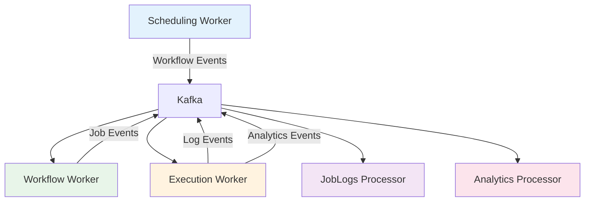
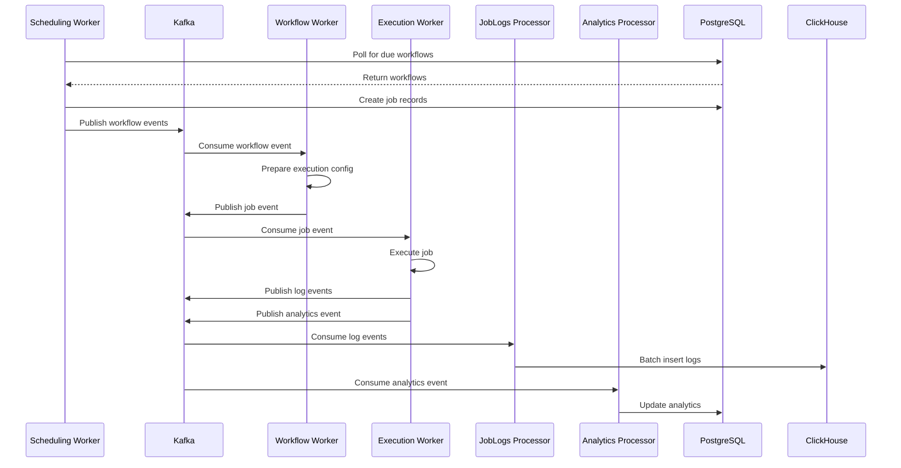

## Overview

Workers are background processes that consume messages from Kafka topics and perform asynchronous operations. They form the processing backbone of Chronoverse, handling everything from job scheduling to log persistence.

All workers are horizontally scalable through Kafka consumer groups, enabling high throughput and fault tolerance.

## Worker Architecture



## Scheduling Worker

### Purpose

Identifies workflows that are due for execution and creates corresponding job records.

### Architecture

<Accordion title="Dependencies">
  - **PostgreSQL**: Stores workflows and jobs
  - **Kafka**: Publishes job events
  - **Configuration**: Poll interval, batch size, fetch limit
</Accordion>

<Accordion title="Configuration">
  ```yaml
  SchedulingWorker:
    PollInterval: 10s      # How often to check for due workflows
    FetchLimit: 100        # Max workflows to fetch per poll
    BatchSize: 50          # Jobs to create per transaction
    ContextTimeout: 30s    # Timeout for database operations
  ```
</Accordion>

### Workflow

<Steps>
  <Step title="Poll Database">
    Every poll interval, query PostgreSQL for workflows due for execution:
    
    ```sql
    SELECT * FROM workflows
    WHERE terminated_at IS NULL
      AND build_status = 'COMPLETED'
      AND (
        last_execution_time IS NULL
        OR last_execution_time + (interval * INTERVAL '1 minute') <= NOW()
      )
    LIMIT {fetch_limit}
    ```
  </Step>
  
  <Step title="Create Job Records">
    For each workflow, create a job entry:
    - Generate unique job ID (UUID)
    - Set `scheduled_at` to current time
    - Set `status` to PENDING
    - Set `trigger` to AUTOMATIC
    - Store in PostgreSQL
  </Step>
  
  <Step title="Publish Events">
    Send job events to Kafka in batches:
    - Topic: `workflows` or `jobs` (depending on workflow type)
    - Partition: Based on workflow ID (ensures ordering)
    - Transactional writes for exactly-once semantics
  </Step>
  
  <Step title="Update Last Execution">
    Update workflow's `last_execution_time` to current time
  </Step>
</Steps>

### Scaling Considerations

- **Single Instance**: Typically runs as a single instance (no consumer group)
- **Concurrency**: Uses database transactions to prevent duplicate job creation
- **Performance**: Poll interval and batch size tune throughput

<Warning>
  Running multiple Scheduling Workers requires database-level locking to prevent race conditions. Not recommended without proper coordination.
</Warning>

## Workflow Worker

### Purpose

Prepares Docker image configurations and execution environments for CONTAINER workflows.

### Architecture

<Accordion title="Dependencies">
  - **Redis**: Caches execution templates
  - **ClickHouse**: Stores workflow metadata
  - **Kafka**: Consumes workflow events, publishes job events
  - **Docker**: Validates images and configurations
  - **gRPC Clients**: Communicates with Workflows, Jobs, and Notifications services
</Accordion>

<Accordion title="Configuration">
  ```yaml
  WorkflowWorker:
    ConsumerGroup: workflow-worker
    ParallelismLimit: 8    # Concurrent workflows to process
  ```
</Accordion>

### Workflow

<Steps>
  <Step title="Consume Workflow Event">
    Read from Kafka's `workflows` topic:
    ```json
    {
      "job_id": "uuid",
      "workflow_id": "uuid",
      "scheduled_at": "2024-03-03T10:00:00Z"
    }
    ```
  </Step>
  
  <Step title="Fetch Workflow Configuration">
    Call Workflows Service via gRPC:
    - Get workflow details (kind, payload, etc.)
    - Validate build status is COMPLETED
  </Step>
  
  <Step title="Parse Payload">
    Extract Docker configuration:
    ```json
    {
      "image": "python:3.11-alpine",
      "command": ["python", "-c"],
      "args": ["print('Hello')"],
      "env": {"KEY": "value"}
    }
    ```
  </Step>
  
  <Step title="Validate Image">
    - Check if image exists in Docker
    - Validate image name format
    - Ensure image is accessible
  </Step>
  
  <Step title="Prepare Execution Template">
    Create execution configuration:
    - Container name: `chronoverse-{job_id}`
    - Network: `chronoverse`
    - Environment variables
    - Resource limits
    - Logging configuration
  </Step>
  
  <Step title="Cache Configuration">
    Store execution template in Redis:
    ```
    Key: job:{job_id}:config
    TTL: 24 hours
    Value: JSON execution template
    ```
  </Step>
  
  <Step title="Publish Job Event">
    Send to Kafka's `jobs` topic:
    ```json
    {
      "job_id": "uuid",
      "workflow_id": "uuid",
      "execution_ready": true
    }
    ```
  </Step>
  
  <Step title="Update Job Status">
    Call Jobs Service to update status to QUEUED
  </Step>
</Steps>

### Error Handling

- **Invalid Image**: Update workflow build status to FAILED
- **Configuration Error**: Log error and fail job with details
- **Service Unavailable**: Retry with exponential backoff (circuit breaker)
- **Timeout**: Mark job as FAILED and log timeout

### Scaling Considerations

- **Consumer Group**: Multiple instances share the load
- **Parallelism**: Each instance processes multiple workflows concurrently
- **Stateless**: No shared state between instances
- **Kafka Partitions**: Scale up to the number of topic partitions

## Execution Worker

### Purpose

Executes scheduled jobs (both HEARTBEAT and CONTAINER types) in isolated environments.

### Architecture

<Accordion title="Dependencies">
  - **Redis**: Fetches execution templates and streams logs
  - **Docker**: Executes containers
  - **Kafka**: Consumes job events, publishes log and analytics events
  - **gRPC Clients**: Communicates with Workflows, Jobs, and Notifications services
</Accordion>

<Accordion title="Configuration">
  ```yaml
  ExecutionWorker:
    ConsumerGroup: execution-worker
    ParallelismLimit: 8    # Concurrent jobs to execute
    DockerHost: unix:///var/run/docker.sock
  ```
</Accordion>

### Workflow

<Steps>
  <Step title="Consume Job Event">
    Read from Kafka's `jobs` topic:
    ```json
    {
      "job_id": "uuid",
      "workflow_id": "uuid",
      "user_id": "uuid"
    }
    ```
  </Step>
  
  <Step title="Fetch Job Details">
    Call Jobs Service via gRPC to get:
    - Job ID and workflow ID
    - Workflow kind (HEARTBEAT or CONTAINER)
    - Current status
  </Step>
  
  <Step title="Update Status to RUNNING">
    - Call Jobs Service to update status
    - Set `started_at` timestamp
    - Publish notification event
  </Step>
  
  <Step title="Execute Based on Kind">
    **HEARTBEAT:**
    ```go
    result := executeHeartbeat()
    status := result ? COMPLETED : FAILED
    ```
    
    **CONTAINER:**
    1. Fetch execution config from Redis
    2. Create Docker container
    3. Start container
    4. Stream logs (stdout/stderr)
    5. Wait for completion
    6. Capture exit code
    ```go
    container := createContainer(config)
    logs := streamLogs(container)
    exitCode := waitForCompletion(container)
    status := exitCode == 0 ? COMPLETED : FAILED
    ```
  </Step>
  
  <Step title="Process Logs">
    For each log line:
    1. Add timestamp and sequence number
    2. Publish to Kafka's `job_logs` topic
    3. Stream to Redis for real-time viewing
    
    ```json
    {
      "job_id": "uuid",
      "timestamp": "2024-03-03T10:00:01.123456789Z",
      "message": "Log line",
      "stream": "stdout",
      "sequence_num": 1
    }
    ```
  </Step>
  
  <Step title="Update Final Status">
    - Call Jobs Service with final status
    - Set `completed_at` timestamp
    - Update workflow consecutive failure count
    - Clean up resources (container, cache)
  </Step>
  
  <Step title="Publish Analytics Event">
    Send metrics to Kafka's `analytics` topic:
    ```json
    {
      "job_id": "uuid",
      "workflow_id": "uuid",
      "status": "COMPLETED",
      "duration_ms": 1234,
      "exit_code": 0
    }
    ```
  </Step>
</Steps>

### Container Lifecycle Management

<Accordion title="Container Creation">
  ```go
  container := dockerClient.CreateContainer({
    Name: fmt.Sprintf("chronoverse-%s", jobID),
    Image: config.Image,
    Cmd: config.Command,
    Env: config.EnvVars,
    Labels: {
      "chronoverse.job_id": jobID,
      "chronoverse.workflow_id": workflowID,
    },
    HostConfig: {
      NetworkMode: "chronoverse",
      AutoRemove: false,
    },
  })
  ```
</Accordion>

<Accordion title="Log Streaming">
  ```go
  logs := dockerClient.Logs(container, {
    ShowStdout: true,
    ShowStderr: true,
    Follow: true,
    Timestamps: true,
  })
  
  for log := range logs {
    publishToKafka(log)
    streamToRedis(log)
  }
  ```
</Accordion>

<Accordion title="Cleanup">
  After job completion:
  1. Stop container (if still running)
  2. Remove container
  3. Delete Redis cache entries
  4. Remove any temporary volumes
</Accordion>

### Error Handling

- **Container Creation Failed**: Log error, mark job as FAILED
- **Container Timeout**: Stop container, mark as FAILED
- **Docker Daemon Unavailable**: Retry with backoff, eventually fail
- **Log Streaming Error**: Continue execution, log error separately

### Scaling Considerations

- **Consumer Group**: Multiple instances process jobs in parallel
- **Docker Access**: Each instance needs Docker socket access
- **Resource Limits**: Monitor Docker host resources
- **Network**: All containers must access `chronoverse` network

<Info>
  Scale Execution Workers based on job volume and execution time. More workers = higher concurrent execution capacity.
</Info>

## JobLogs Processor

### Purpose

Persists job logs from Kafka to ClickHouse and MeiliSearch for efficient storage and querying.

### Architecture

<Accordion title="Dependencies">
  - **Redis**: Temporary log storage for running jobs
  - **ClickHouse**: Long-term log storage
  - **MeiliSearch**: Full-text search indexing
  - **Kafka**: Consumes log events
</Accordion>

<Accordion title="Configuration">
  ```yaml
  JobLogsProcessor:
    ConsumerGroup: joblogs-processor
    BatchJobLogsSizeLimit: 1000        # Max logs per batch
    BatchJobLogsTimeInterval: 5s       # Max time between flushes
    BatchAnalyticsTimeInterval: 10s    # Analytics batch interval
  ```
</Accordion>

### Workflow

<Steps>
  <Step title="Consume Log Events">
    Read from Kafka's `job_logs` topic:
    ```json
    {
      "job_id": "uuid",
      "workflow_id": "uuid",
      "timestamp": "2024-03-03T10:00:01.123456789Z",
      "message": "Application log line",
      "stream": "stdout",
      "sequence_num": 1
    }
    ```
  </Step>
  
  <Step title="Batch Accumulation">
    Accumulate logs until:
    - Batch size reaches limit (e.g., 1000 logs)
    - Time interval expires (e.g., 5 seconds)
    - Whichever comes first
  </Step>
  
  <Step title="Write to ClickHouse">
    Batch insert logs to ClickHouse:
    ```sql
    INSERT INTO job_logs (
      job_id, workflow_id, user_id, timestamp,
      message, stream, sequence_num
    ) VALUES (...)
    ```
    
    ClickHouse optimizations:
    - Column-oriented storage for compression
    - Time-based partitioning
    - Asynchronous inserts
  </Step>
  
  <Step title="Index in MeiliSearch">
    Add logs to search index:
    ```json
    {
      "id": "job_id:sequence_num",
      "job_id": "uuid",
      "message": "Log line",
      "timestamp": "2024-03-03T10:00:01Z",
      "stream": "stdout"
    }
    ```
  </Step>
  
  <Step title="Commit Kafka Offset">
    After successful writes, commit offset to Kafka
  </Step>
</Steps>

### Batching Strategy

<Accordion title="Size-Based Batching">
  When batch reaches configured size:
  - Reduces write operations
  - Improves throughput
  - May increase latency slightly
</Accordion>

<Accordion title="Time-Based Batching">
  When time interval expires:
  - Ensures timely writes
  - Prevents indefinite accumulation
  - Handles low-volume scenarios
</Accordion>

### Error Handling

- **ClickHouse Unavailable**: Retry with backoff, don't commit offset
- **MeiliSearch Unavailable**: Log error, continue (search is non-critical)
- **Batch Write Failed**: Retry entire batch, eventually move to dead-letter queue

### Scaling Considerations

- **Consumer Group**: Multiple instances for parallel processing
- **Partition Assignment**: Kafka rebalancing distributes load
- **Write Throughput**: ClickHouse batching improves performance
- **Search Indexing**: MeiliSearch can handle concurrent writes

<Note>
  JobLogs Processor is optimized for high-volume log ingestion. Scale based on log volume and write latency requirements.
</Note>

## Analytics Processor

### Purpose

Consumes job and workflow events to generate analytics data and metrics.

### Architecture

<Accordion title="Dependencies">
  - **PostgreSQL**: Stores aggregated analytics
  - **Kafka**: Consumes analytics events
</Accordion>

<Accordion title="Configuration">
  ```yaml
  AnalyticsProcessor:
    ConsumerGroup: analytics-processor
    BatchTimeInterval: 10s
  ```
</Accordion>

### Workflow

<Steps>
  <Step title="Consume Analytics Events">
    Read from Kafka's `analytics` topic:
    ```json
    {
      "event_type": "job_completed",
      "job_id": "uuid",
      "workflow_id": "uuid",
      "status": "COMPLETED",
      "duration_ms": 1234,
      "timestamp": "2024-03-03T10:00:00Z"
    }
    ```
  </Step>
  
  <Step title="Process Event">
    Extract metrics:
    - Job success/failure counts
    - Execution duration statistics
    - Workflow reliability metrics
    - Resource usage patterns
  </Step>
  
  <Step title="Aggregate Data">
    Update analytics tables in PostgreSQL:
    ```sql
    UPDATE workflow_analytics
    SET total_jobs = total_jobs + 1,
        total_duration_ms = total_duration_ms + {duration},
        last_execution = {timestamp}
    WHERE workflow_id = {workflow_id}
    ```
  </Step>
  
  <Step title="Commit Offset">
    After successful write, commit Kafka offset
  </Step>
</Steps>

### Metrics Tracked

<CardGroup cols={2}>
  <Card title="Job Metrics" icon="chart-line">
    - Total executions
    - Success rate
    - Failure rate
    - Average duration
    - Duration percentiles (p50, p95, p99)
  </Card>
  
  <Card title="Workflow Metrics" icon="diagram-project">
    - Active workflows count
    - Terminated workflows
    - Average interval
    - Consecutive failures trend
  </Card>
  
  <Card title="System Metrics" icon="server">
    - Total jobs processed
    - Worker utilization
    - Queue depth
    - Processing latency
  </Card>
  
  <Card title="User Metrics" icon="user">
    - Workflows per user
    - Jobs per user
    - Resource consumption
    - Activity patterns
  </Card>
</CardGroup>

### Scaling Considerations

- **Consumer Group**: Multiple instances for parallel processing
- **Database Writes**: Use batching and upserts for efficiency
- **Aggregation**: Consider time-windowed aggregations for large datasets

## Worker Communication Flow

### Complete Job Execution Flow



## Monitoring Workers

### Health Checks

All workers expose health metrics:

- **Kafka Consumer Lag**: How far behind the latest message
- **Processing Rate**: Messages processed per second
- **Error Rate**: Failed message processing attempts
- **Resource Usage**: CPU, memory, disk I/O

### Observability

Workers integrate with OpenTelemetry:

- **Traces**: Track message processing flow
- **Metrics**: Consumer lag, processing time, error counts
- **Logs**: Structured logging with context

<Info>
  View worker metrics in Grafana dashboards (LGTM stack) on port 3000.
</Info>

## Worker Best Practices

### Configuration Tuning

<Steps>
  <Step title="Consumer Group Size">
    - Start with 1-2 instances per worker type
    - Scale based on consumer lag metrics
    - Don't exceed Kafka partition count
  </Step>
  
  <Step title="Parallelism Limits">
    - Set based on available CPU cores
    - Monitor resource utilization
    - Account for I/O-bound operations
  </Step>
  
  <Step title="Batch Sizes">
    - Larger batches = higher throughput, higher latency
    - Smaller batches = lower latency, more overhead
    - Tune based on workload characteristics
  </Step>
</Steps>

### Error Handling

- **Transient Errors**: Retry with exponential backoff
- **Permanent Errors**: Log and move to dead-letter queue
- **Circuit Breakers**: Prevent cascading failures
- **Graceful Degradation**: Continue processing other messages

### Resource Management

- **Connection Pooling**: Reuse database connections
- **Memory Limits**: Set container memory limits
- **Garbage Collection**: Monitor and tune GC settings
- **Graceful Shutdown**: Handle SIGTERM for clean exits

## Next Steps

<CardGroup cols={2}>
  <Card title="Architecture" icon="sitemap" href="/concepts/architecture">
    Learn about overall system architecture
  </Card>
  <Card title="Workflows" icon="diagram-project" href="/concepts/workflows">
    Understand workflow concepts
  </Card>
  <Card title="Jobs" icon="clock" href="/concepts/jobs">
    Learn about job execution
  </Card>
  <Card title="Deployment" icon="rocket" href="/deployment/docker-compose">
    Deploy and configure workers
  </Card>
</CardGroup>