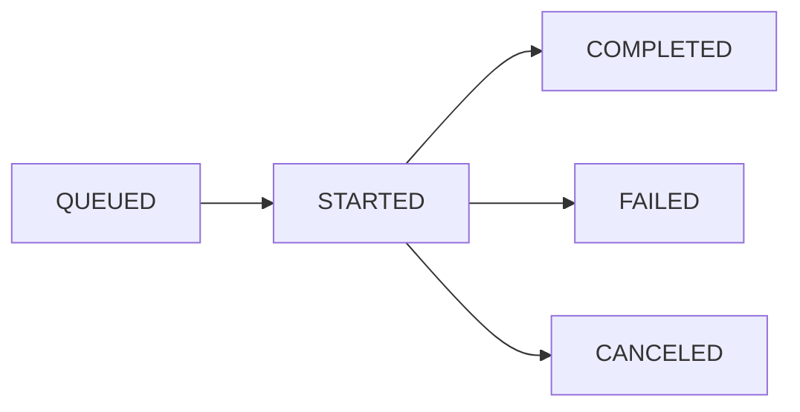
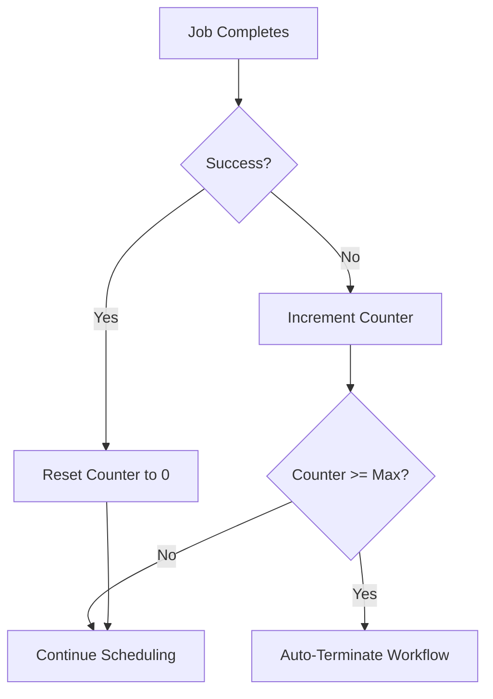

## Overview

Workflows are the core abstraction in Chronoverse that define what should be executed and how often. A workflow represents a scheduled task that runs at specified intervals, with built-in failure tracking and automatic termination capabilities.

## Workflow Types

Chronoverse supports two workflow types, each designed for different use cases:

### HEARTBEAT

A simple health check workflow that verifies system availability.

<Accordion title="Use Cases">
  - Service health monitoring
  - Endpoint availability checks
  - System liveness probes
  - Network connectivity tests
</Accordion>

<Accordion title="Behavior">
  - Executes instantly with minimal overhead
  - Returns success/failure status
  - No payload configuration required
  - Ideal for high-frequency monitoring (every 1-5 minutes)
</Accordion>

<Accordion title="Example Payload">
  ```json
  {
    "kind": "HEARTBEAT"
  }
  ```
</Accordion>

### CONTAINER

Executes custom containerized applications and scripts in isolated Docker containers.

<Accordion title="Use Cases">
  - Data processing pipelines
  - ETL jobs
  - Backup and maintenance tasks
  - Custom business logic
  - Scheduled reports generation
  - Database cleanup operations
</Accordion>

<Accordion title="Behavior">
  - Pulls or builds Docker images
  - Executes in isolated containers
  - Captures stdout/stderr logs
  - Supports environment variables and volumes
  - Automatic cleanup after execution
</Accordion>

<Accordion title="Example Payload">
  ```json
  {
    "kind": "CONTAINER",
    "image": "python:3.11-alpine",
    "command": ["python", "-c"],
    "args": ["print('Hello from Chronoverse!')"],
    "env": {
      "API_KEY": "your-api-key",
      "ENVIRONMENT": "production"
    }
  }
  ```
</Accordion>

## Workflow Properties

Each workflow has the following properties:

<ResponseField name="id" type="string" required>
  Unique identifier (UUID) for the workflow
</ResponseField>

<ResponseField name="user_id" type="string" required>
  ID of the user who owns the workflow
</ResponseField>

<ResponseField name="name" type="string" required>
  Human-readable name for the workflow
</ResponseField>

<ResponseField name="kind" type="string" required>
  Workflow type: `HEARTBEAT` or `CONTAINER`
</ResponseField>

<ResponseField name="payload" type="string" required>
  JSON string containing workflow configuration (varies by kind)
</ResponseField>

<ResponseField name="interval" type="integer" required>
  Execution interval in minutes (minimum: 1)
</ResponseField>

<ResponseField name="max_consecutive_job_failures_allowed" type="integer" required>
  Maximum number of consecutive failures before auto-termination
</ResponseField>

<ResponseField name="consecutive_job_failures_count" type="integer">
  Current count of consecutive failures (read-only)
</ResponseField>

<ResponseField name="build_status" type="string">
  Current build status for CONTAINER workflows:
  - `QUEUED`: Waiting to be processed
  - `STARTED`: Build in progress
  - `COMPLETED`: Ready for execution
  - `FAILED`: Build failed
  - `CANCELED`: Build was canceled
</ResponseField>

<ResponseField name="created_at" type="timestamp">
  Workflow creation time (RFC3339 format)
</ResponseField>

<ResponseField name="updated_at" type="timestamp">
  Last update time (RFC3339 format)
</ResponseField>

<ResponseField name="terminated_at" type="timestamp">
  Termination time if workflow is terminated (RFC3339 format)
</ResponseField>

## Workflow Lifecycle

### 1. Creation

When a workflow is created:

1. User submits workflow definition via API
2. System validates the payload and parameters
3. Workflow is stored in PostgreSQL
4. For CONTAINER workflows, build status is set to `QUEUED`
5. Workflow Worker picks up CONTAINER workflows and prepares execution environment

<Note>
  HEARTBEAT workflows are immediately ready for execution and don't require a build phase.
</Note>

### 2. Building (CONTAINER only)



The Workflow Worker:
- Validates the Docker image and configuration
- Prepares execution templates
- Stores configuration in Redis for fast access
- Updates build status accordingly

<Info>
  Workflows with `FAILED` or `CANCELED` build status won't be scheduled for execution.
</Info>

### 3. Scheduling

The Scheduling Worker continuously:

1. Polls PostgreSQL for workflows due for execution
2. Calculates next execution time based on interval
3. Creates job entries in the jobs table
4. Publishes job events to Kafka's `workflows` topic

<Accordion title="Scheduling Logic">
  ```
  next_execution = last_execution_time + (interval * 60 seconds)
  
  if current_time >= next_execution:
    schedule_new_job()
  ```
</Accordion>

### 4. Execution

When a job is scheduled:

1. Workflow Worker (for CONTAINER) or Execution Worker (for HEARTBEAT) consumes the event
2. Job status changes from `PENDING` → `QUEUED` → `RUNNING`
3. Execution happens in isolated environment
4. Logs are captured and sent to Kafka's `job_logs` topic
5. Job completes with `COMPLETED` or `FAILED` status

### 5. Failure Tracking

After each job execution:

- **On Success**: `consecutive_job_failures_count` is reset to 0
- **On Failure**: `consecutive_job_failures_count` is incremented



<Warning>
  When `consecutive_job_failures_count` reaches `max_consecutive_job_failures_allowed`, the workflow is automatically terminated to prevent resource waste.
</Warning>

### 6. Termination

Workflows can be terminated:

1. **Manually**: User terminates via API
2. **Automatically**: After reaching max consecutive failures
3. **Via Deletion**: Workflow deletion also terminates it

Terminated workflows:
- Stop being scheduled for execution
- Retain all historical data
- Can be identified by non-null `terminated_at` timestamp
- Cannot be reactivated (create a new workflow instead)

## Build Status Details

For CONTAINER workflows, the build status indicates readiness:

<Card title="QUEUED" icon="clock">
  Workflow is waiting in the build queue. The Workflow Worker will pick it up soon.
</Card>

<Card title="STARTED" icon="spinner">
  Workflow Worker is currently building the execution environment. This includes validating the Docker image and preparing configuration.
</Card>

<Card title="COMPLETED" icon="check">
  Build successful. Workflow is ready for execution and will be scheduled according to its interval.
</Card>

<Card title="FAILED" icon="xmark">
  Build failed due to invalid configuration, missing image, or other errors. Check logs for details. The workflow won't be scheduled until fixed.
</Card>

<Card title="CANCELED" icon="ban">
  Build was canceled before completion. This can happen if the workflow is updated or deleted during build.
</Card>

## Payload Configuration

### HEARTBEAT Payload

Heartbeat workflows have minimal configuration:

```json
{
  "kind": "HEARTBEAT"
}
```

### CONTAINER Payload

Container workflows support extensive configuration:

```json
{
  "kind": "CONTAINER",
  "image": "python:3.11-alpine",
  "command": ["python", "-c"],
  "args": [
    "import requests; response = requests.get('https://api.example.com/health'); print(f'Status: {response.status_code}')"
  ],
  "env": {
    "API_ENDPOINT": "https://api.example.com",
    "TIMEOUT": "30"
  },
  "working_dir": "/app"
}
```

<ParamField path="image" type="string" required>
  Docker image to use (e.g., `python:3.11-alpine`, `node:20-alpine`, custom registry images)
</ParamField>

<ParamField path="command" type="array">
  Override the default command of the image (e.g., `["python", "-c"]`)
</ParamField>

<ParamField path="args" type="array">
  Arguments to pass to the command
</ParamField>

<ParamField path="env" type="object">
  Environment variables as key-value pairs
</ParamField>

<ParamField path="working_dir" type="string">
  Working directory inside the container
</ParamField>

## Best Practices

### Interval Selection

<Accordion title="High-Frequency Monitoring (1-5 minutes)">
  - Use HEARTBEAT workflows
  - Monitor critical services
  - Keep payloads simple
  - Set reasonable failure thresholds (e.g., 3-5)
</Accordion>

<Accordion title="Regular Jobs (10-60 minutes)">
  - Suitable for most CONTAINER workflows
  - Data processing, backups, reports
  - Balance between timeliness and resource usage
  - Set higher failure thresholds (e.g., 5-10)
</Accordion>

<Accordion title="Hourly/Daily Jobs (60+ minutes)">
  - Heavy processing tasks
  - Large data operations
  - Batch processing
  - Set appropriate timeouts
</Accordion>

### Failure Handling

<Steps>
  <Step title="Set Appropriate Thresholds">
    Consider the nature of your workflow:
    - Flaky external APIs: Higher threshold (5-10)
    - Critical internal services: Lower threshold (2-3)
    - Experimental workflows: Medium threshold (3-5)
  </Step>
  
  <Step title="Monitor Failure Counts">
    Regularly check `consecutive_job_failures_count` and investigate:
    - Approaching threshold? Address underlying issues
    - Auto-terminated? Fix and recreate workflow
  </Step>
  
  <Step title="Use Notifications">
    Enable real-time notifications to catch failures early
  </Step>
</Steps>

### Container Optimization

- **Use Alpine Images**: Smaller, faster to pull (e.g., `python:3.11-alpine`)
- **Minimize Layers**: Keep Docker images lean
- **Cache Images**: Frequently used images are cached by Docker
- **Set Resource Limits**: Prevent resource exhaustion
- **Handle Signals**: Implement graceful shutdown in your code

## Next Steps

<CardGroup cols={2}>
  <Card title="Create Workflow" icon="plus" href="/api-reference/workflows/create">
    Learn how to create your first workflow
  </Card>
  <Card title="Jobs" icon="list-check" href="/concepts/jobs">
    Understand job execution and monitoring
  </Card>
  <Card title="Workers" icon="gears" href="/concepts/workers">
    Learn how workers process workflows
  </Card>
  <Card title="API Reference" icon="book" href="/api-reference/workflows/overview">
    Complete workflow API documentation
  </Card>
</CardGroup>