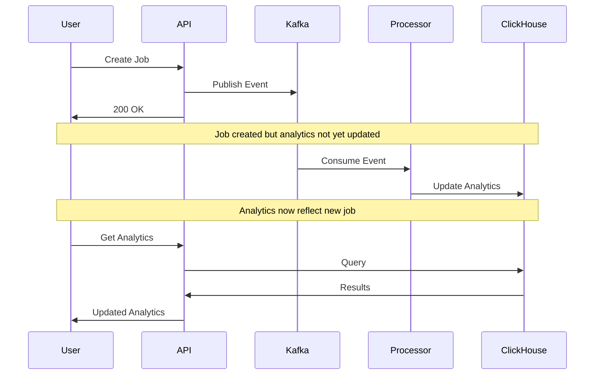

Chronoverse provides comprehensive analytics for tracking workflow and job performance, execution trends, and resource utilization. Analytics data is aggregated in real-time using ClickHouse for efficient querying at scale.

## Overview

Analytics in Chronoverse offer insights into:

- **User-level metrics**: Total workflows, jobs, logs, and execution time across all workflows
- **Workflow-level metrics**: Per-workflow job counts, log volumes, and execution durations
- **Real-time aggregation**: Metrics updated as events occur through Kafka stream processing
- **Efficient storage**: ClickHouse provides fast aggregation queries even with millions of jobs

<Info>
Analytics are computed asynchronously by the Analytics Processor, which consumes workflow, job, and log events from Kafka topics.
</Info>

## User Analytics

Get aggregate statistics for all workflows owned by a user.

### Endpoint

```bash Get User Analytics
curl "https://api.chronoverse.io/v1/analytics/users/{user_id}" \
  -H "Authorization: Bearer YOUR_TOKEN"
```

### Response Format

```json User Analytics
{
  "total_workflows": 25,
  "total_jobs": 15420,
  "total_joblogs": 1847293,
  "total_job_execution_duration": 892340
}
```

### Metrics Explained

| Metric | Type | Description |
|--------|------|-------------|
| `total_workflows` | integer | Count of all workflows ever created (active, terminated, deleted) |
| `total_jobs` | integer | Total jobs executed across all workflows |
| `total_joblogs` | integer | Total log entries generated across all jobs |
| `total_job_execution_duration` | integer | Sum of all job execution times in seconds |

<Tabs>
  <Tab title="total_workflows">
    Counts distinct workflows including:
    - Active workflows (not terminated)
    - Terminated workflows
    - Deleted workflows (soft-deleted)
    
    ```sql ClickHouse Query
    SELECT COUNT(DISTINCT workflow_id) AS total_workflows
    FROM analytics
    WHERE user_id = ?
    ```
  </Tab>
  
  <Tab title="total_jobs">
    Sum of all jobs across workflows:
    
    ```sql ClickHouse Query
    SELECT COALESCE(SUM(jobs_count), 0) AS total_jobs
    FROM analytics
    WHERE user_id = ?
    ```
  </Tab>
  
  <Tab title="total_joblogs">
    Sum of all log entries:
    
    ```sql ClickHouse Query
    SELECT COALESCE(SUM(logs_count), 0) AS total_joblogs
    FROM analytics
    WHERE user_id = ?
    ```
  </Tab>
  
  <Tab title="total_job_execution_duration">
    Total execution time in seconds:
    
    ```sql ClickHouse Query
    SELECT COALESCE(SUM(total_job_execution_duration), 0)
    FROM analytics
    WHERE user_id = ?
    ```
    
    Convert to human-readable format:
    ```javascript
    const hours = Math.floor(seconds / 3600);
    const minutes = Math.floor((seconds % 3600) / 60);
    // 892340 seconds = 247 hours, 52 minutes
    ```
  </Tab>
</Tabs>

### Use Cases

<CardGroup cols={2}>
  <Card title="Resource Planning" icon="server">
    Understand total compute usage to plan infrastructure capacity
  </Card>
  
  <Card title="Cost Tracking" icon="dollar-sign">
    Calculate execution costs based on total runtime and resource usage
  </Card>
  
  <Card title="Usage Trends" icon="chart-line">
    Track growth in workflows and job execution over time
  </Card>
  
  <Card title="Log Volume" icon="database">
    Monitor log storage requirements based on total log entries
  </Card>
</CardGroup>

## Workflow Analytics

Get detailed metrics for a specific workflow.

### Endpoint

```bash Get Workflow Analytics
curl "https://api.chronoverse.io/v1/analytics/workflows/{workflow_id}" \
  -H "Authorization: Bearer YOUR_TOKEN"
```

### Response Format

```json Workflow Analytics
{
  "workflow_id": "550e8400-e29b-41d4-a716-446655440000",
  "total_jobs": 620,
  "total_joblogs": 74832,
  "total_job_execution_duration": 18450
}
```

### Metrics Explained

| Metric | Type | Description |
|--------|------|-------------|
| `workflow_id` | string | UUID of the workflow |
| `total_jobs` | integer | Total jobs executed by this workflow |
| `total_joblogs` | integer | Total log entries from all jobs |
| `total_job_execution_duration` | integer | Sum of execution times in seconds |

### Query Implementation

```sql ClickHouse Query
SELECT
    workflow_id,
    jobs_count AS total_jobs,
    logs_count AS total_joblogs,
    total_job_execution_duration
FROM analytics
WHERE user_id = ? AND workflow_id = ?
LIMIT 1
```

<Info>
Each workflow has a single analytics record that's continuously updated as jobs execute and generate logs.
</Info>

### Derived Metrics

You can calculate additional insights from workflow analytics:

<CodeGroup>
```javascript Average Execution Time
const avgExecutionTime = 
  analytics.total_job_execution_duration / analytics.total_jobs;

// Example: 18450 / 620 = 29.76 seconds per job
```

```javascript Average Logs Per Job
const avgLogsPerJob = 
  analytics.total_joblogs / analytics.total_jobs;

// Example: 74832 / 620 = 120.7 logs per job
```

```javascript Execution Efficiency
// Compare against workflow interval to find utilization
const intervalSeconds = workflowInterval * 60;
const utilization = 
  (avgExecutionTime / intervalSeconds) * 100;

// 5-minute interval: (29.76 / 300) * 100 = 9.92% utilization
```
</CodeGroup>

## Analytics Processing Pipeline

Analytics are computed asynchronously through event stream processing:

### Architecture

<Steps>
  <Step title="Event Generation">
    Services publish events to Kafka topics:
    - Workflow events (create, update, delete)
    - Job events (start, complete, fail)
    - Log events (log entries created)
  </Step>
  
  <Step title="Analytics Processor">
    Consumer processes events and updates aggregations
  </Step>
  
  <Step title="ClickHouse Update">
    Analytics table updated with new counts and durations
  </Step>
  
  <Step title="API Query">
    REST API queries ClickHouse for current metrics
  </Step>
</Steps>

### Event Processing

<Tabs>
  <Tab title="Workflow Events">
    ```go Workflow Created
    // Increment workflow count
    INSERT INTO analytics (user_id, workflow_id, jobs_count, logs_count, total_job_execution_duration)
    VALUES (?, ?, 0, 0, 0)
    ON CONFLICT (user_id, workflow_id) DO NOTHING
    ```
    
    ```go Workflow Deleted
    // Keep analytics record for historical data
    // No deletion from analytics table
    ```
  </Tab>
  
  <Tab title="Job Events">
    ```go Job Completed
    // Update jobs count and execution duration
    UPDATE analytics
    SET 
      jobs_count = jobs_count + 1,
      total_job_execution_duration = total_job_execution_duration + ?
    WHERE user_id = ? AND workflow_id = ?
    ```
    
    Execution duration calculated as:
    ```javascript
    duration = completed_at - started_at  // in seconds
    ```
  </Tab>
  
  <Tab title="Log Events">
    ```go Logs Inserted
    // Batch update for efficiency
    UPDATE analytics
    SET logs_count = logs_count + ?
    WHERE user_id = ? AND workflow_id = ?
    ```
    
    Batched by the JobLogs Processor:
    ```javascript
    // Process 100 logs at once
    batchSize = 100
    logsCount += batchSize
    ```
  </Tab>
</Tabs>

## Analytics Table Schema

The ClickHouse analytics table stores aggregated data:

```sql Table Structure
CREATE TABLE analytics (
    user_id UUID,
    workflow_id UUID,
    jobs_count UInt32,
    logs_count UInt64,
    total_job_execution_duration UInt64,
    created_at DateTime64(3),
    updated_at DateTime64(3)
)
ENGINE = MergeTree()
ORDER BY (user_id, workflow_id)
PRIMARY KEY (user_id, workflow_id);
```

### Indexing Strategy

- **Primary Key**: `(user_id, workflow_id)` for efficient user and workflow queries
- **Order By**: Same as primary key for optimal compression
- **Engine**: MergeTree for fast aggregations and updates

<Tip>
The primary key enables sub-millisecond query performance even with millions of workflows.
</Tip>

## Error Handling

### Not Found Errors

If no analytics exist for a user or workflow:

```json Error Response
{
  "code": "NOT_FOUND",
  "message": "no analytics found for workflow"
}
```

**Causes:**
- Workflow was just created (analytics not yet processed)
- Invalid workflow ID
- User doesn't own the workflow

<Info>
Analytics records are created asynchronously. New workflows may not have analytics immediately available.
</Info>

### Invalid Request

```json Error Response
{
  "code": "INVALID_ARGUMENT",
  "message": "invalid user ID or workflow ID"
}
```

**Causes:**
- Malformed UUID
- Empty user_id or workflow_id

## Real-Time vs. Eventual Consistency

<Warning>
**Important Timing Considerations:**

Analytics are **eventually consistent**, not real-time:

- Events must be processed through Kafka
- Analytics Processor has processing latency (typically less than 1 second)
- ClickHouse updates are batched for efficiency

**Expected Delay:** 1-5 seconds from event occurrence to analytics update
</Warning>

### Consistency Examples



## Performance Characteristics

### Query Performance

| Operation | Typical Latency | Scale |
|-----------|----------------|-------|
| Get User Analytics | Less than 10ms | Millions of workflows |
| Get Workflow Analytics | Less than 5ms | Billions of jobs |
| Analytics Update | Less than 100ms | High throughput |

### Scalability

ClickHouse enables analytics at scale:

- **User Analytics**: Aggregates across thousands of workflows
- **Workflow Analytics**: Handles billions of job records
- **Log Counting**: Efficiently counts trillions of log entries

<Tip>
ClickHouse's columnar storage and efficient aggregation make it ideal for analytics workloads, even with massive data volumes.
</Tip>

## Best Practices

<CardGroup cols={2}>
  <Card title="Cache on Client" icon="memory">
    Analytics change slowly—cache results for 30-60 seconds to reduce API calls
  </Card>
  
  <Card title="Calculate Rates" icon="calculator">
    Derive metrics like average execution time, logs per job, and efficiency ratios
  </Card>
  
  <Card title="Expect Delays" icon="clock">
    Don't expect instant analytics updates—allow 1-5 seconds for consistency
  </Card>
  
  <Card title="Monitor Trends" icon="chart-line">
    Track analytics over time to identify performance trends and anomalies
  </Card>
</CardGroup>

## Limitations

<Info>
**Current Limitations:**

- No time-series breakdowns (daily, weekly, monthly)
- No job status-specific counts (success vs. failure rates)
- No percentile metrics (p50, p95, p99 execution times)
- No workflow kind filtering
- No custom date ranges

These features may be added in future releases based on user feedback.
</Info>

## Example Use Cases

### Dashboard Widgets

```javascript User Overview Widget
const analytics = await getUserAnalytics(userId);

const widgets = [
  {
    title: 'Total Workflows',
    value: analytics.total_workflows,
    icon: 'workflow'
  },
  {
    title: 'Jobs Executed',
    value: analytics.total_jobs.toLocaleString(),
    icon: 'tasks'
  },
  {
    title: 'Execution Time',
    value: formatDuration(analytics.total_job_execution_duration),
    icon: 'clock'
  },
  {
    title: 'Log Entries',
    value: formatNumber(analytics.total_joblogs),
    icon: 'file-text'
  }
];
```

### Workflow Comparison

```javascript Compare Workflows
const workflows = await listWorkflows();
const analyticsPromises = workflows.map(wf => 
  getWorkflowAnalytics(wf.id)
);
const analytics = await Promise.all(analyticsPromises);

// Sort by most active
const sortedByJobs = analytics.sort((a, b) => 
  b.total_jobs - a.total_jobs
);

// Find most verbose (logs per job)
const withRates = analytics.map(a => ({
  ...a,
  logsPerJob: a.total_joblogs / a.total_jobs
}));
```

## Next Steps

<CardGroup cols={2}>
  <Card title="Workflow Types" icon="diagram-project" href="/features/workflow-types">
    Learn about HEARTBEAT and CONTAINER workflows
  </Card>
  <Card title="API Reference" icon="code" href="/api-reference">
    Complete API documentation for analytics endpoints
  </Card>
</CardGroup>