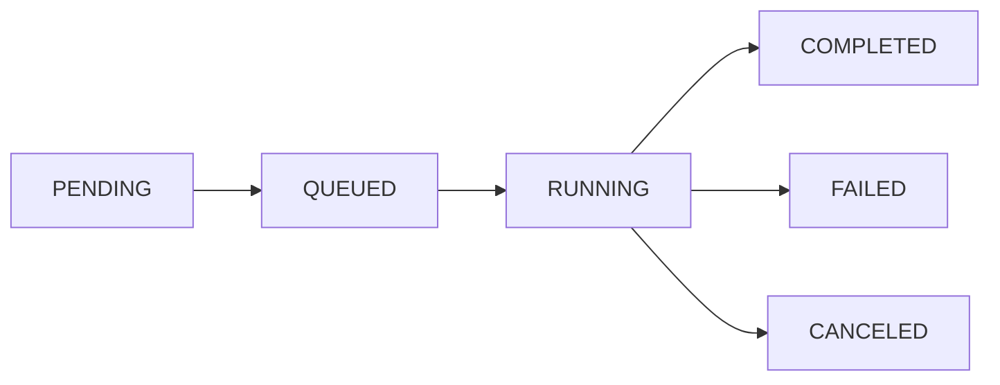

Chronoverse provides flexible job scheduling with both automatic interval-based execution and on-demand manual triggering. Jobs represent individual executions of a workflow.

## Job Lifecycle

Every job progresses through distinct states from creation to completion:



### Status States

| Status | Description | Terminal |
|--------|-------------|----------|
| `PENDING` | Job created, awaiting scheduling worker | No |
| `QUEUED` | Picked up by execution worker, awaiting container start | No |
| `RUNNING` | Container executing or heartbeat in progress | No |
| `COMPLETED` | Execution succeeded (exit code 0 or status match) | Yes |
| `FAILED` | Execution failed (non-zero exit code or timeout) | Yes |
| `CANCELED` | Job was manually canceled by user | Yes |

<Info>
Terminal statuses indicate job completion. Jobs in terminal states cannot transition to other states.
</Info>

## Trigger Types

Jobs are created through two distinct mechanisms:

### AUTOMATIC Trigger

Automatic jobs are scheduled by the scheduling worker based on workflow intervals.

<Steps>
  <Step title="Interval Calculation">
    Scheduling worker calculates next execution time using the workflow's interval
  </Step>
  
  <Step title="Job Creation">
    Job record is created with `AUTOMATIC` trigger and scheduled timestamp
  </Step>
  
  <Step title="Kafka Publishing">
    Job details are published to the execution topic for processing
  </Step>
  
  <Step title="Worker Pickup">
    Execution worker consumes the message and starts execution
  </Step>
</Steps>

**Characteristics:**
- Scheduled at fixed intervals defined in the workflow
- Cannot be skipped or paused individually
- Workflow termination stops future automatic jobs
- Execution time may drift slightly due to processing delays

### MANUAL Trigger

Manual jobs are created on-demand via API calls.

```bash Schedule Manual Job
curl -X POST https://api.chronoverse.io/v1/workflows/{workflow_id}/jobs \
  -H "Authorization: Bearer YOUR_TOKEN" \
  -H "Content-Type: application/json" \
  -d '{
    "scheduled_at": "2026-03-03T15:30:00Z"
  }'
```

**Characteristics:**
- Immediate or future scheduled execution
- Can be scheduled even for terminated workflows (if desired)
- Useful for testing, debugging, or ad-hoc executions
- Subject to same validation and execution rules as automatic jobs

<Tip>
Use manual triggers to test workflow configurations before relying on automatic scheduling.
</Tip>

## Scheduling Mechanism

### Scheduling Worker

The scheduling worker is responsible for identifying jobs ready for execution:

<CodeGroup>
```go Job Selection Logic
// Identifies jobs where scheduled_at <= current_time
// and status is PENDING
SELECT id, workflow_id, user_id, trigger, scheduled_at
FROM jobs
WHERE scheduled_at <= NOW()
  AND status = 'PENDING'
ORDER BY scheduled_at ASC
LIMIT 100
```

```go Kafka Publishing
// Job details published to execution topic
{
  "job_id": "uuid-here",
  "workflow_id": "workflow-uuid",
  "user_id": "user-uuid",
  "trigger": "AUTOMATIC",
  "scheduled_at": "2026-03-03T10:00:00Z"
}
```
</CodeGroup>

### Execution Worker

The execution worker consumes job messages and executes them:

<Steps>
  <Step title="Message Consumption">
    Worker consumes job message from Kafka execution topic
  </Step>
  
  <Step title="Status Update">
    Job status updated to `QUEUED`
  </Step>
  
  <Step title="Workflow Retrieval">
    Workflow configuration fetched including kind and payload
  </Step>
  
  <Step title="Execution">
    - **HEARTBEAT**: HTTP request sent to endpoint
    - **CONTAINER**: Docker container created and started
  </Step>
  
  <Step title="Result Processing">
    - Logs captured and published to Redis/ClickHouse
    - Job status updated based on execution outcome
    - Workflow failure counter adjusted
  </Step>
</Steps>

## Interval-Based Scheduling

Automatic jobs follow interval-based scheduling patterns:

### How Intervals Work

```javascript Interval Examples
// Workflow created at 2026-03-03 10:00:00
// with interval: 60 (minutes)

Job 1: 2026-03-03 10:00:00  // Initial creation
Job 2: 2026-03-03 11:00:00  // +60 minutes
Job 3: 2026-03-03 12:00:00  // +60 minutes
Job 4: 2026-03-03 13:00:00  // +60 minutes
```

<Info>
The next job is scheduled based on the **scheduled_at** time of the previous job, not its completion time. This ensures consistent intervals.
</Info>

### Common Interval Patterns

<Tabs>
  <Tab title="High Frequency">
    ```json Every Minute
    {
      "interval": 1,
      "description": "Real-time monitoring"
    }
    ```
    
    ```json Every 5 Minutes
    {
      "interval": 5,
      "description": "Frequent health checks"
    }
    ```
  </Tab>
  
  <Tab title="Hourly">
    ```json Every Hour
    {
      "interval": 60,
      "description": "Hourly data sync"
    }
    ```
    
    ```json Every 6 Hours
    {
      "interval": 360,
      "description": "Quarterly daily checks"
    }
    ```
  </Tab>
  
  <Tab title="Daily/Weekly">
    ```json Daily
    {
      "interval": 1440,
      "description": "Daily batch processing"
    }
    ```
    
    ```json Weekly
    {
      "interval": 10080,
      "description": "Weekly reports"
    }
    ```
  </Tab>
</Tabs>

## Scheduled Time Validation

All job scheduling requests validate the `scheduled_at` timestamp:

```go Validation Rules
// Must be valid RFC3339 format
"2026-03-03T15:30:00Z"  // Valid
"2026-03-03T15:30:00+05:30"  // Valid with timezone
"2026-03-03 15:30:00"  // Invalid format

// Can be in the past (for manual triggers)
// Can be in the future (up to workflow limits)
```

<Warning>
Jobs scheduled in the past will execute immediately once picked up by the scheduling worker. Use future timestamps for delayed execution.
</Warning>

## Filtering and Listing Jobs

Retrieve jobs with filters to narrow results:

### Available Filters

```bash List Jobs with Filters
curl "https://api.chronoverse.io/v1/workflows/{workflow_id}/jobs?status=COMPLETED&trigger=AUTOMATIC" \
  -H "Authorization: Bearer YOUR_TOKEN"
```

**Filter Parameters:**

| Parameter | Values | Description |
|-----------|--------|-------------|
| `status` | `PENDING`, `QUEUED`, `RUNNING`, `COMPLETED`, `FAILED`, `CANCELED` | Filter by job status |
| `trigger` | `AUTOMATIC`, `MANUAL` | Filter by trigger type |
| `cursor` | base64 string | Pagination cursor for next page |

### Pagination

Job listings use cursor-based pagination:

```json Response Format
{
  "jobs": [
    {
      "id": "job-uuid",
      "workflow_id": "workflow-uuid",
      "status": "COMPLETED",
      "trigger": "AUTOMATIC",
      "scheduled_at": "2026-03-03T10:00:00Z",
      "started_at": "2026-03-03T10:00:02Z",
      "completed_at": "2026-03-03T10:00:15Z",
      "created_at": "2026-03-03T09:59:58Z",
      "updated_at": "2026-03-03T10:00:15Z"
    }
  ],
  "cursor": "base64-encoded-next-page-token"
}
```

<Tip>
Use the returned `cursor` value in subsequent requests to fetch the next page of results.
</Tip>

## Failure Tracking

Jobs impact workflow health through consecutive failure tracking:

### Failure Counter Behavior

<CodeGroup>
```javascript Failed Job
// When job fails (status = FAILED)
// Workflow consecutive_job_failures_count increments

POST /internal/workflows/{id}/increment-failures
// Returns: { "threshold_reached": false }
```

```javascript Successful Job
// When job succeeds (status = COMPLETED)
// Workflow consecutive_job_failures_count resets to 0

POST /internal/workflows/{id}/reset-failures
```

```javascript Threshold Reached
// When failures >= max_consecutive_job_failures_allowed
// Workflow is automatically terminated

// Response: { "threshold_reached": true }
// Action: Workflow.terminated_at = NOW()
```
</CodeGroup>

<Warning>
Once a workflow is terminated due to consecutive failures, it stops scheduling new automatic jobs. Manual jobs can still be scheduled if needed.
</Warning>

## Job Execution Timeouts

Each workflow type has timeout constraints:

### HEARTBEAT Timeouts

- **Default**: 10 seconds
- **Maximum**: 5 minutes
- **Timeout Result**: Job status set to `FAILED`

### CONTAINER Timeouts

- **Default**: 30 seconds
- **Maximum**: 1 hour
- **Timeout Behavior**:
  1. Container receives stop signal
  2. 2-second grace period
  3. Force kill if still running
  4. Job status set to `FAILED`
  5. Logs captured up to timeout

```json Timeout Configuration
{
  "kind": "CONTAINER",
  "payload": {
    "timeout": "15m",  // 15 minutes
    "image": "long-running:latest",
    "cmd": ["python", "batch.py"]
  }
}
```

## Best Practices

<CardGroup cols={2}>
  <Card title="Interval Selection" icon="clock">
    Choose intervals based on workload requirements. Avoid unnecessarily short intervals that waste resources.
  </Card>
  
  <Card title="Manual Testing" icon="flask">
    Use manual triggers to test workflows before relying on automatic scheduling.
  </Card>
  
  <Card title="Timeout Tuning" icon="gauge">
    Set timeouts slightly higher than expected execution time to account for variability.
  </Card>
  
  <Card title="Failure Thresholds" icon="triangle-exclamation">
    Set `max_consecutive_job_failures_allowed` to balance between sensitivity and stability.
  </Card>
</CardGroup>

## Next Steps

<CardGroup cols={2}>
  <Card title="Log Streaming" icon="stream" href="/features/log-streaming">
    Access real-time job logs during execution
  </Card>
  <Card title="Analytics" icon="chart-line" href="/features/analytics">
    Track job performance and trends
  </Card>
</CardGroup>