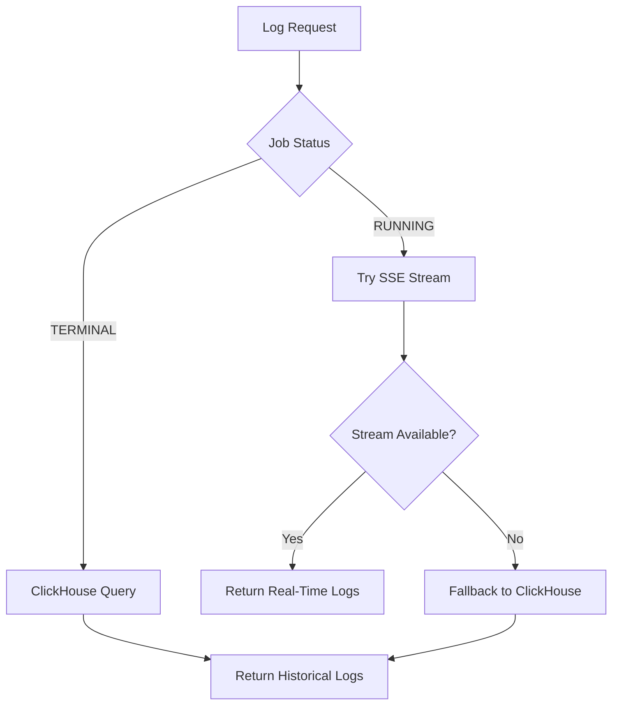

Chronoverse provides comprehensive logging for all job executions with real-time streaming capabilities and efficient long-term storage in ClickHouse.

## Overview

Job logs are captured from two sources depending on the workflow type:

- **HEARTBEAT workflows**: HTTP request/response details and error messages
- **CONTAINER workflows**: Complete stdout and stderr output from containers

All logs are:
- Streamed in real-time during execution via **Redis Pub/Sub**
- Batch inserted into **ClickHouse** for persistent storage and querying
- Accessible via REST API with Server-Sent Events (SSE) for live jobs

## Log Entry Structure

Each log entry contains standardized fields:

```json Log Entry Format
{
  "timestamp": "2026-03-03T10:30:45.123456Z",
  "message": "Processing completed successfully",
  "sequence_num": 42,
  "stream": "stdout"
}
```

### Field Descriptions

| Field | Type | Description |
|-------|------|-------------|
| `timestamp` | string | ISO 8601 timestamp with microsecond precision |
| `message` | string | Log message content |
| `sequence_num` | integer | Sequential number for ordering (starts at 0) |
| `stream` | string | Log source: `stdout`, `stderr`, or `system` |

<Info>
Sequence numbers ensure correct log ordering even when timestamps are identical or network delays occur.
</Info>

## Real-Time Streaming

For jobs in `RUNNING` status, Chronoverse streams logs in real-time using Server-Sent Events (SSE).

### Stream Connection

```bash SSE Connection
curl -N https://api.chronoverse.io/v1/workflows/{workflow_id}/jobs/{job_id}/logs/stream \
  -H "Authorization: Bearer YOUR_TOKEN" \
  -H "Accept: text/event-stream"
```

### SSE Event Format

```plaintext Server-Sent Events
event: log
data: {"timestamp":"2026-03-03T10:30:45.123Z","message":"Starting process","sequence_num":0,"stream":"stdout"}

event: log
data: {"timestamp":"2026-03-03T10:30:46.456Z","message":"Loading configuration","sequence_num":1,"stream":"stdout"}

event: log
data: {"timestamp":"2026-03-03T10:30:47.789Z","message":"Warning: deprecated API","sequence_num":2,"stream":"stderr"}

event: close
data: {"reason":"job_completed"}
```

### Event Types

<Tabs>
  <Tab title="log">
    Standard log entry containing execution output
    
    ```json
    {
      "timestamp": "2026-03-03T10:30:45.123Z",
      "message": "Processing item 1 of 100",
      "sequence_num": 5,
      "stream": "stdout"
    }
    ```
  </Tab>
  
  <Tab title="close">
    Stream termination signal when job completes or connection ends
    
    ```json
    {
      "reason": "job_completed"
    }
    ```
    
    **Reasons:**
    - `job_completed`: Job reached terminal status
    - `job_failed`: Job execution failed
    - `timeout`: Stream timeout exceeded
    - `canceled`: Job was canceled
  </Tab>
</Tabs>

### Architecture: Redis Pub/Sub

Real-time streaming uses Redis Pub/Sub for efficient fan-out:

<Steps>
  <Step title="Log Generation">
    Container or heartbeat executor generates log messages
  </Step>
  
  <Step title="Redis Publishing">
    Logs published to job-specific channel: `job:logs:{job_id}`
  </Step>
  
  <Step title="Client Subscription">
    API server subscribes to the channel when client connects via SSE
  </Step>
  
  <Step title="Event Broadcasting">
    Messages forwarded to client as SSE events
  </Step>
  
  <Step title="Batch Storage">
    Simultaneously, logs are batched to Kafka for ClickHouse insertion
  </Step>
</Steps>

```go Redis Channel Pattern
// Channel format: job:logs:{job_id}
"job:logs:550e8400-e29b-41d4-a716-446655440000"

// Published message
{
  "job_id": "550e8400-e29b-41d4-a716-446655440000",
  "timestamp": "2026-03-03T10:30:45.123456Z",
  "message": "Processing...",
  "sequence_num": 10,
  "stream": "stdout"
}
```

<Tip>
Redis Pub/Sub provides ephemeral streaming. If no clients are subscribed, messages are not stored. Historical logs are retrieved from ClickHouse.
</Tip>

## Historical Logs (ClickHouse)

Completed jobs and paginated log access use ClickHouse storage.

### Storage Architecture

<Steps>
  <Step title="Log Collection">
    JobLogs Processor consumes log events from Kafka
  </Step>
  
  <Step title="Batch Accumulation">
    Logs accumulated in batches for efficient insertion
  </Step>
  
  <Step title="ClickHouse Insert">
    Batches inserted into ClickHouse logs table
  </Step>
  
  <Step title="Query Optimization">
    Indexed by job_id, timestamp, and stream for fast retrieval
  </Step>
</Steps>

### Retrieving Historical Logs

```bash Get Job Logs
curl "https://api.chronoverse.io/v1/workflows/{workflow_id}/jobs/{job_id}/logs" \
  -H "Authorization: Bearer YOUR_TOKEN"
```

**Response:**

```json
{
  "id": "job-uuid",
  "workflow_id": "workflow-uuid",
  "logs": [
    {
      "timestamp": "2026-03-03T10:30:45.123Z",
      "message": "Container started",
      "sequence_num": 0,
      "stream": "stdout"
    },
    {
      "timestamp": "2026-03-03T10:30:46.456Z",
      "message": "Processing 100 records",
      "sequence_num": 1,
      "stream": "stdout"
    }
  ],
  "cursor": "base64-encoded-pagination-token"
}
```

### Pagination

Large log sets use cursor-based pagination:

```bash Paginated Request
curl "https://api.chronoverse.io/v1/workflows/{workflow_id}/jobs/{job_id}/logs?cursor=eyJzZXF1ZW5jZSI6MTAwfQ==" \
  -H "Authorization: Bearer YOUR_TOKEN"
```

<Info>
Each request returns up to 100 log entries. Use the `cursor` field from the response to fetch the next page.
</Info>

## Stream Filtering

Filter logs by stream type to focus on specific output:

### Available Streams

<Tabs>
  <Tab title="ALL">
    Returns all log streams (stdout, stderr, system)
    
    ```bash
    curl "https://api.chronoverse.io/v1/workflows/{wf}/jobs/{job}/logs?stream=ALL"
    ```
  </Tab>
  
  <Tab title="STDOUT">
    Only standard output logs
    
    ```bash
    curl "https://api.chronoverse.io/v1/workflows/{wf}/jobs/{job}/logs?stream=STDOUT"
    ```
  </Tab>
  
  <Tab title="STDERR">
    Only standard error logs (useful for debugging)
    
    ```bash
    curl "https://api.chronoverse.io/v1/workflows/{wf}/jobs/{job}/logs?stream=STDERR"
    ```
  </Tab>
</Tabs>

### Stream Enum Values

```protobuf Proto Definition
enum LogStream {
    LOG_STREAM_UNSPECIFIED = 0;
    LOG_STREAM_STDOUT      = 1;
    LOG_STREAM_STDERR      = 2;
    LOG_STREAM_ALL         = 3;
}
```

## Log Search

Search logs by message content with full-text filtering:

```bash Search Logs
curl "https://api.chronoverse.io/v1/workflows/{workflow_id}/jobs/{job_id}/logs/search?message=error&stream=STDERR" \
  -H "Authorization: Bearer YOUR_TOKEN"
```

### Search Parameters

| Parameter | Type | Description |
|-----------|------|-------------|
| `message` | string | Text to search for in log messages (case-sensitive) |
| `stream` | enum | Filter by stream type (STDOUT, STDERR, ALL) |
| `cursor` | string | Pagination cursor for results |

**Response Format:**

```json Search Results
{
  "id": "job-uuid",
  "workflow_id": "workflow-uuid",
  "logs": [
    {
      "timestamp": "2026-03-03T10:30:50.123Z",
      "message": "Error: connection timeout",
      "sequence_num": 15,
      "stream": "stderr"
    },
    {
      "timestamp": "2026-03-03T10:31:10.456Z",
      "message": "Error: retry limit exceeded",
      "sequence_num": 42,
      "stream": "stderr"
    }
  ],
  "cursor": "next-page-token"
}
```

<Warning>
Search results are cached for 15 minutes for terminal job statuses. Live jobs always query fresh data.
</Warning>

## Log Caching Strategy

Chronoverse employs intelligent caching for log retrieval:

### Cache Behavior

<CodeGroup>
```javascript Terminal Status
// Jobs in COMPLETED, FAILED, or CANCELED status
// Logs cached for 30 minutes

if (jobStatus in ['COMPLETED', 'FAILED', 'CANCELED']) {
  cacheKey = `job_logs:${userId}:${jobId}:${cursor}:${stream}`
  cacheTTL = 30 * 60  // 30 minutes
}
```

```javascript Live Status
// Jobs in PENDING, QUEUED, or RUNNING status
// No caching - always fetch fresh data

if (jobStatus in ['PENDING', 'QUEUED', 'RUNNING']) {
  // Direct ClickHouse query
  // Or fallback to Redis stream for real-time
}
```

```javascript With Pagination
// Pages with next cursor are cached
// Assumes data is stable for that page

if (response.cursor !== '') {
  cache.set(cacheKey, response, 30 * 60)
}
```
</CodeGroup>

<Tip>
Terminal status logs are safe to cache since they won't change. Running jobs bypass cache to show the latest output.
</Tip>

## Container Log Capture

For CONTAINER workflows, logs are captured from Docker:

### Capture Process

<Steps>
  <Step title="Container Start">
    Docker container starts with stdout/stderr streaming enabled
  </Step>
  
  <Step title="Stream Demuxing">
    Docker's multiplexed stream is separated into stdout and stderr
  </Step>
  
  <Step title="Sequence Numbering">
    Atomic counter assigns sequence numbers to each log line
  </Step>
  
  <Step title="Dual Publishing">
    - Redis Pub/Sub for real-time streaming
    - Kafka topic for persistent storage
  </Step>
</Steps>

```go Log Capture Implementation
// Atomic sequence counter
var sequenceNum uint32

// Read stdout
scanner := bufio.NewScanner(stdoutReader)
for scanner.Scan() {
    msg := scanner.Text()
    log := JobLog{
        Timestamp: time.Now(),
        Message: msg,
        SequenceNum: atomic.LoadUint32(&sequenceNum),
        Stream: "stdout"
    }
    atomic.AddUint32(&sequenceNum, 1)
    
    // Publish to Redis and Kafka
    publishLog(log)
}
```

<Info>
Logs are captured line-by-line. Very long lines (>2000 characters) may be truncated to prevent memory issues.
</Info>

## Automatic Fallback Behavior

The API automatically chooses the best log source:



<Tabs>
  <Tab title="Real-Time (SSE)">
    **When:**
    - Job status is `RUNNING`
    - SSE connection requested
    
    **Behavior:**
    - Subscribe to Redis channel
    - Stream logs as they're generated
    - Auto-close on job completion
  </Tab>
  
  <Tab title="Historical (ClickHouse)">
    **When:**
    - Job status is terminal (`COMPLETED`, `FAILED`, `CANCELED`)
    - Regular HTTP request (not SSE)
    - Real-time stream unavailable
    
    **Behavior:**
    - Query ClickHouse logs table
    - Return paginated results
    - Utilize cache for terminal statuses
  </Tab>
</Tabs>

## Best Practices

<CardGroup cols={2}>
  <Card title="Stream for Live Jobs" icon="broadcast-tower">
    Use SSE streaming for active jobs to monitor progress in real-time without polling.
  </Card>
  
  <Card title="Filter by Stream" icon="filter">
    Use STDERR filtering to quickly identify errors and warnings during debugging.
  </Card>
  
  <Card title="Search for Errors" icon="magnifying-glass">
    Leverage log search to find specific error messages across large log volumes.
  </Card>
  
  <Card title="Handle Pagination" icon="page">
    Always check for the `cursor` field and paginate through results for complete logs.
  </Card>
</CardGroup>

## Limitations

<Warning>
**Known Limitations:**

- Real-time streams require persistent SSE connection
- Redis Pub/Sub messages are ephemeral (not persisted)
- Search is case-sensitive exact substring match
- Maximum log line length: ~2000 characters
- Pagination page size: 100 entries
</Warning>

## Next Steps

<CardGroup cols={2}>
  <Card title="Notifications" icon="bell" href="/features/notifications">
    Set up real-time alerts for job status changes
  </Card>
  <Card title="Analytics" icon="chart-line" href="/features/analytics">
    Analyze job execution patterns and log volumes
  </Card>
</CardGroup>