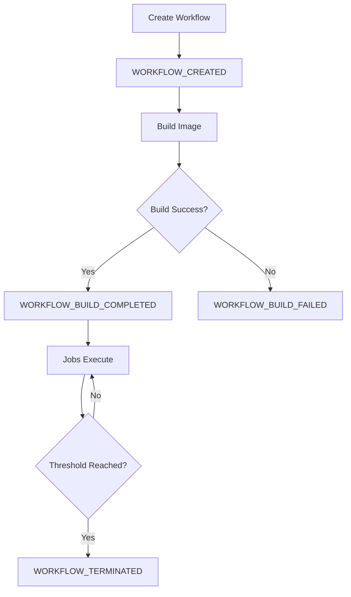
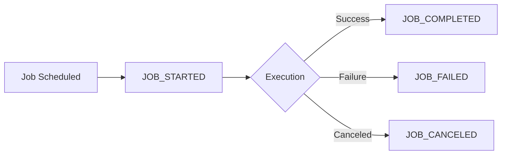

Chronoverse provides a real-time notification system that alerts users to important workflow and job state changes. Notifications are delivered instantly through Redis Pub/Sub and stored in PostgreSQL for historical access.

## Overview

Notifications keep you informed about:

- **Workflow Events**: Creation, updates, build status changes, terminations
- **Job Events**: Execution starts, completions, failures, cancellations
- **System Events**: Critical errors, threshold breaches, service alerts

All notifications are:
- Created automatically by internal services
- Delivered in real-time via dashboard subscriptions
- Stored persistently in PostgreSQL
- Paginated for historical access

<Info>
Notifications are read-only from the user perspective. They're created by the system as events occur and can be marked as read but not edited or deleted individually.
</Info>

## Notification Structure

Each notification follows a standardized format:

```json Notification Format
{
  "id": "550e8400-e29b-41d4-a716-446655440000",
  "kind": "WORKFLOW_CREATED",
  "payload": {
    "workflow_id": "workflow-uuid",
    "workflow_name": "API Health Check",
    "workflow_kind": "HEARTBEAT"
  },
  "read_at": null,
  "created_at": "2026-03-03T10:30:45.123Z",
  "updated_at": "2026-03-03T10:30:45.123Z"
}
```

### Field Descriptions

| Field | Type | Description |
|-------|------|-------------|
| `id` | string | Unique notification identifier (UUID) |
| `kind` | string | Notification type (see Notification Kinds below) |
| `payload` | object | Event-specific data as JSON |
| `read_at` | string\|null | ISO timestamp when marked as read, or null if unread |
| `created_at` | string | When the notification was created |
| `updated_at` | string | Last update timestamp |

## Notification Kinds

Different events generate different notification types:

### Workflow Notifications

<Tabs>
  <Tab title="WORKFLOW_CREATED">
    New workflow successfully created
    
    ```json Payload
    {
      "workflow_id": "uuid",
      "workflow_name": "Daily ETL",
      "workflow_kind": "CONTAINER",
      "interval": 1440
    }
    ```
  </Tab>
  
  <Tab title="WORKFLOW_UPDATED">
    Workflow configuration changed
    
    ```json Payload
    {
      "workflow_id": "uuid",
      "workflow_name": "Daily ETL",
      "changes": ["interval", "payload"]
    }
    ```
  </Tab>
  
  <Tab title="WORKFLOW_BUILD_COMPLETED">
    Docker image build/pull succeeded
    
    ```json Payload
    {
      "workflow_id": "uuid",
      "workflow_name": "Data Processor",
      "build_status": "COMPLETED"
    }
    ```
  </Tab>
  
  <Tab title="WORKFLOW_BUILD_FAILED">
    Docker image build/pull failed
    
    ```json Payload
    {
      "workflow_id": "uuid",
      "workflow_name": "Data Processor",
      "build_status": "FAILED",
      "error": "Image not found: invalid:tag"
    }
    ```
  </Tab>
  
  <Tab title="WORKFLOW_TERMINATED">
    Workflow terminated (manually or by failure threshold)
    
    ```json Payload
    {
      "workflow_id": "uuid",
      "workflow_name": "API Monitor",
      "reason": "consecutive_failures",
      "failure_count": 5
    }
    ```
  </Tab>
</Tabs>

### Job Notifications

<Tabs>
  <Tab title="JOB_STARTED">
    Job execution began
    
    ```json Payload
    {
      "job_id": "uuid",
      "workflow_id": "uuid",
      "workflow_name": "Health Check",
      "trigger": "AUTOMATIC",
      "scheduled_at": "2026-03-03T10:30:00Z"
    }
    ```
  </Tab>
  
  <Tab title="JOB_COMPLETED">
    Job finished successfully
    
    ```json Payload
    {
      "job_id": "uuid",
      "workflow_id": "uuid",
      "workflow_name": "Health Check",
      "duration_seconds": 12.5,
      "status": "COMPLETED"
    }
    ```
  </Tab>
  
  <Tab title="JOB_FAILED">
    Job execution failed
    
    ```json Payload
    {
      "job_id": "uuid",
      "workflow_id": "uuid",
      "workflow_name": "Health Check",
      "status": "FAILED",
      "error": "Connection timeout",
      "duration_seconds": 30.0
    }
    ```
  </Tab>
  
  <Tab title="JOB_CANCELED">
    Job was manually canceled
    
    ```json Payload
    {
      "job_id": "uuid",
      "workflow_id": "uuid",
      "workflow_name": "Long Process",
      "canceled_by": "user-uuid",
      "status": "CANCELED"
    }
    ```
  </Tab>
</Tabs>

## Creating Notifications (Internal)

Notifications are created by internal services via gRPC:

```protobuf Service Definition
service NotificationsService {
    rpc CreateNotification(CreateNotificationRequest) 
        returns (CreateNotificationResponse) {}
}

message CreateNotificationRequest {
    string user_id  = 1;
    string kind     = 2;
    string payload  = 3;  // JSON string
}
```

### Internal Usage Example

```go Creating Notification
// When a job fails
notificationReq := &notificationspb.CreateNotificationRequest{
    UserId: job.UserID,
    Kind:   "JOB_FAILED",
    Payload: json.Marshal(map[string]any{
        "job_id":        job.ID,
        "workflow_id":   job.WorkflowID,
        "workflow_name": workflow.Name,
        "status":        "FAILED",
        "error":         err.Error(),
    }),
}

res, err := notificationsClient.CreateNotification(ctx, notificationReq)
```

<Warning>
The `CreateNotification` RPC is an internal API. It's not exposed in the public REST API and can only be called by authenticated internal services.
</Warning>

## Retrieving Notifications

Users can list their notifications via the REST API:

```bash List Notifications
curl "https://api.chronoverse.io/v1/notifications" \
  -H "Authorization: Bearer YOUR_TOKEN"
```

### Response Format

```json Notifications List
{
  "notifications": [
    {
      "id": "notif-1",
      "kind": "JOB_FAILED",
      "payload": {
        "job_id": "job-uuid",
        "workflow_name": "Health Check",
        "error": "Timeout"
      },
      "read_at": null,
      "created_at": "2026-03-03T11:00:00Z",
      "updated_at": "2026-03-03T11:00:00Z"
    },
    {
      "id": "notif-2",
      "kind": "WORKFLOW_CREATED",
      "payload": {
        "workflow_id": "wf-uuid",
        "workflow_name": "New ETL"
      },
      "read_at": "2026-03-03T10:45:00Z",
      "created_at": "2026-03-03T10:30:00Z",
      "updated_at": "2026-03-03T10:45:00Z"
    }
  ],
  "cursor": "base64-next-page-token"
}
```

### Pagination

```bash Paginated Request
curl "https://api.chronoverse.io/v1/notifications?cursor=eyJpZCI6Im5vdGlmLTIwIn0=" \
  -H "Authorization: Bearer YOUR_TOKEN"
```

<Info>
Notifications are ordered by `created_at` descending (newest first). Each page returns up to 50 notifications.
</Info>

## Marking Notifications as Read

Mark one or more notifications as read:

```bash Mark as Read
curl -X PATCH "https://api.chronoverse.io/v1/notifications/read" \
  -H "Authorization: Bearer YOUR_TOKEN" \
  -H "Content-Type: application/json" \
  -d '{
    "ids": [
      "550e8400-e29b-41d4-a716-446655440000",
      "660e8400-e29b-41d4-a716-446655440001"
    ]
  }'
```

### Request Validation

```protobuf Validation Rules
message MarkNotificationsReadRequest {
    repeated string ids = 1;  // Required, min 1 ID
    string user_id      = 2;  // Required, from auth token
}
```

**Constraints:**
- Minimum 1 notification ID required
- Maximum 100 IDs per request
- User can only mark their own notifications
- Already-read notifications can be marked again (idempotent)

<Tip>
Marking notifications as read updates the `read_at` and `updated_at` timestamps. Use this to track when users acknowledged specific events.
</Tip>

## Real-Time Delivery

Notifications are delivered in real-time through the dashboard via Redis Pub/Sub.

### Pub/Sub Architecture

<Steps>
  <Step title="Event Occurs">
    Workflow or job state changes trigger notification creation
  </Step>
  
  <Step title="Database Insert">
    Notification stored in PostgreSQL for persistence
  </Step>
  
  <Step title="Redis Publish">
    Notification published to user-specific channel: `notifications:{user_id}`
  </Step>
  
  <Step title="Dashboard Subscription">
    Connected dashboard clients receive notification instantly
  </Step>
  
  <Step title="UI Update">
    Dashboard displays notification in real-time
  </Step>
</Steps>

### Channel Pattern

```plaintext Redis Channels
// User-specific notification channel
notifications:550e8400-e29b-41d4-a716-446655440000

// Published message format
{
  "id": "notification-uuid",
  "kind": "JOB_FAILED",
  "payload": {...},
  "created_at": "2026-03-03T10:30:45Z"
}
```

<Info>
Dashboard clients subscribe to their user-specific channel on connection. When notifications are published, all connected clients receive them immediately.
</Info>

## Notification Payload Validation

Payloads must be valid JSON objects:

```go Payload Validation
// Valid payloads
{
  "workflow_id": "uuid",
  "status": "COMPLETED"
}

// Invalid - not JSON
"just a string"

// Invalid - null
null

// Invalid - array
["item1", "item2"]
```

<Warning>
Notification creation fails if the payload is not a valid JSON object. Ensure all event data is properly serialized before creating notifications.
</Warning>

## Common Notification Patterns

### Workflow Lifecycle



### Job Execution Flow



## Filtering and Queries

While the current API doesn't support filtering, you can filter notifications client-side:

```javascript Client-Side Filtering
// Filter by notification kind
const failedJobs = notifications.filter(n => n.kind === 'JOB_FAILED');

// Filter unread notifications
const unread = notifications.filter(n => n.read_at === null);

// Filter by workflow
const workflowNotifs = notifications.filter(n => 
  n.payload.workflow_id === 'target-workflow-uuid'
);
```

<Tip>
For high-volume notification scenarios, consider implementing server-side filtering by notification kind or read status in your dashboard.
</Tip>

## Best Practices

<CardGroup cols={2}>
  <Card title="Subscribe in Dashboard" icon="bell">
    Connect to Redis Pub/Sub in your dashboard for instant notification delivery without polling.
  </Card>
  
  <Card title="Batch Mark as Read" icon="check-double">
    Mark multiple notifications as read in a single API call to reduce requests.
  </Card>
  
  <Card title="Handle Pagination" icon="page">
    Always paginate through historical notifications to avoid missing important events.
  </Card>
  
  <Card title="Parse Payloads Safely" icon="shield">
    Validate notification payload structure before accessing fields to handle schema evolution.
  </Card>
</CardGroup>

## Notification Retention

<Info>
**Retention Policy:**

- Notifications are stored indefinitely in PostgreSQL
- No automatic cleanup or archival
- Users can only mark as read, not delete
- Consider periodic manual cleanup for very old notifications
</Info>

## Next Steps

<CardGroup cols={2}>
  <Card title="Analytics" icon="chart-line" href="/features/analytics">
    Track workflow and job performance metrics
  </Card>
  <Card title="API Reference" icon="code" href="/api-reference">
    Complete API documentation for all endpoints
  </Card>
</CardGroup>