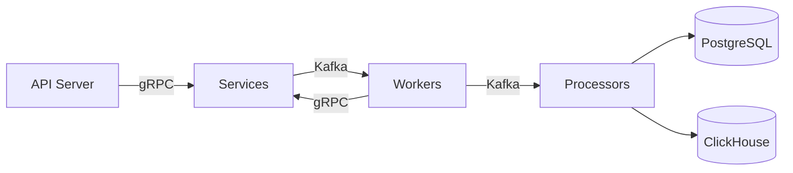

## What is Chronoverse?

Chronoverse is a distributed job scheduling and orchestration system designed for **reliability** and **scalability**. It allows you to define, schedule, and execute various types of jobs across your infrastructure with powerful monitoring and management capabilities.

Built with a message-driven microservices architecture, Chronoverse communicates through Kafka for reliable async processing and gRPC for low-latency synchronous operations. This dual approach ensures both reliability for critical background processes and responsiveness for user-facing operations.

## Key Features

<CardGroup cols={2}>
  <Card title="Workflow Management" icon="diagram-project">
    Create, update, and monitor scheduled workflows with flexible configuration and precise time intervals.
  </Card>
  
  <Card title="Multiple Workflow Types" icon="boxes-stacked">
    Support for HEARTBEAT health checks and CONTAINER workflows for custom containerized applications.
  </Card>
  
  <Card title="Job Logs & Analytics" icon="chart-line">
    Comprehensive execution history stored in ClickHouse with real-time log streaming via Server-Sent Events.
  </Card>
  
  <Card title="Real-time Notifications" icon="bell">
    Dashboard-based alerts for workflow and job state changes with configurable preferences.
  </Card>
  
  <Card title="Full Observability" icon="magnifying-glass-chart">
    Built-in OpenTelemetry integration for traces, metrics, and logs with Grafana dashboards.
  </Card>
  
  <Card title="Secure by Default" icon="shield-halved">
    JWT-based authentication, TLS encryption for all services, and mTLS for service-to-service communication.
  </Card>
</CardGroup>

## Architecture Overview

Chronoverse implements a message-driven microservices architecture with two primary communication channels:

### Core Services

- **Server** - HTTP API gateway with authentication and authorization middleware
- **Users Service** - User accounts, authentication tokens, and notification preferences  
- **Workflows Service** - Workflow definitions, configuration, and build status
- **Jobs Service** - Job lifecycle management from scheduling to completion
- **Notifications Service** - Real-time alerts and status updates
- **Analytics Service** - Job and workflow performance insights

### Worker Components

- **Scheduling Worker** - Identifies jobs due for execution and processes them via Kafka
- **Workflow Worker** - Builds Docker image configurations and execution templates
- **Execution Worker** - Executes jobs in isolated containers with resource management
- **JobLogs Processor** - Batch inserts execution logs from Kafka to ClickHouse
- **Analytics Processor** - Processes job/workflow events to generate analytics data
- **Database Migration** - Manages schema evolution for PostgreSQL and ClickHouse

### Data Persistence

<Info>
  Chronoverse uses **PostgreSQL** for transactional data and **ClickHouse** for analytics and high-volume job logs, providing optimal performance for both operational and analytical workloads.
</Info>

### Communication Patterns

- **Kafka** - Reliable, asynchronous event-driven workflows
- **gRPC** - Efficient, low-latency synchronous service communication

## Technology Stack

<CardGroup cols={3}>
  <Card title="Backend" icon="golang">
    Go 1.25.4
  </Card>
  <Card title="Message Queue" icon="stream">
    Apache Kafka
  </Card>
  <Card title="Databases" icon="database">
    PostgreSQL 18, ClickHouse 25.8
  </Card>
  <Card title="Cache" icon="server">
    Redis 8.2
  </Card>
  <Card title="Search" icon="magnifying-glass">
    Meilisearch 1.15
  </Card>
  <Card title="Observability" icon="chart-mixed">
    OpenTelemetry + Grafana
  </Card>
</CardGroup>

## Use Cases

Chronoverse is ideal for:

- **Scheduled Data Processing** - ETL pipelines, data synchronization, batch processing
- **Health Monitoring** - Service health checks, infrastructure monitoring, uptime tracking
- **Workflow Automation** - CI/CD pipelines, deployment automation, maintenance tasks
- **Report Generation** - Scheduled reports, analytics processing, data aggregation
- **Container Orchestration** - Running containerized workloads on a schedule

## Why Chronoverse?

<CardGroup cols={2}>
  <Card title="Self-Hosted" icon="house">
    Run entirely on your infrastructure with full control over your data and security.
  </Card>
  
  <Card title="Horizontally Scalable" icon="up-right-and-down-left-from-center">
    Workers communicate through Kafka topics, enabling horizontal scaling and fault tolerance.
  </Card>
  
  <Card title="Production Ready" icon="circle-check">
    Built with security, observability, and reliability as first-class concerns.
  </Card>
  
  <Card title="Developer Friendly" icon="code">
    Simple REST API, comprehensive logs, and real-time monitoring via SSE.
  </Card>
</CardGroup>

## Next Steps

<CardGroup cols={2}>
  <Card title="Quickstart" icon="rocket" href="/quickstart">
    Get Chronoverse running in minutes with Docker Compose
  </Card>
  
  <Card title="Installation" icon="download" href="/installation">
    Detailed installation instructions for development and production
  </Card>
</CardGroup>
